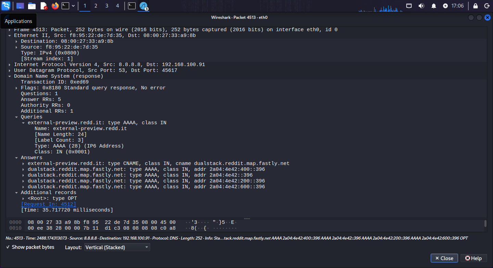

# 🌐 DNS — Port 53 | Practical Lab

**Author:** Muhammad Awais Javed (Mian Awais) · **Date:** April 2026 · **Part of:** [SOC-Journey-2026](https://github.com/awaisjaved-soc/SOC-Journey-2026)

---

## 📌 Table of Contents

- [🎯 Objective](#-objective)
- [📖 What is DNS?](#-what-is-dns)
- [⚙️ How It Works](#️-how-it-works)
- [🧪 Lab Environment](#-lab-environment)
- [💻 Commands Used](#-commands-used)
- [🔍 Wireshark Analysis](#-wireshark-analysis)
- [🚨 SOC Analyst Notes](#-soc-analyst-notes)
- [🛡️ MITRE ATT&CK](#️-mitre-attck)
- [📸 Screenshots](#-screenshots)
- [✅ Key Takeaways](#-key-takeaways)

---

## 🎯 Objective

To understand how DNS works in real life by setting up my own DNS server, querying it from another device, and analyzing the traffic in Wireshark — so I can recognize normal vs. suspicious DNS behavior on a SOC dashboard.

---

## 📖 What is DNS?

DNS (Domain Name System) is the **"phonebook of the internet"**. It converts human-readable domain names (`google.com`) into machine-readable IP addresses (`142.250.190.78`).

### Why DNS Uses UDP Port 53 (While Others Use TCP)

| | TCP | UDP |
|---|---|---|
| **Handshake** | 3-way handshake before data flows | None — fire and forget |
| **Reliability** | Acknowledgments, retransmission, ordering | No guarantees |
| **Speed** | Slower (more overhead) | Very fast |
| **Good for** | File transfer, email, web pages — where losing data is bad | Real-time traffic, **DNS** — where speed matters more than perfect reliability |

### Why DNS Chooses UDP

1. **DNS queries are tiny** — a normal query + response is usually under 512 bytes. Losing one small packet is not a big deal.
2. **Speed is critical** — almost every website visit starts with a DNS query. If each one needed a TCP 3-way handshake first, the internet would feel much slower.
3. **Reliability is built in anyway** — if no response arrives within 1–2 seconds, the client automatically retries, and can fall back to another server (e.g., from `8.8.8.8` to `1.1.1.1`).
4. **TCP is the exception** — DNS only switches to TCP when the response is very large (>512 bytes) or for **zone transfers** (copying the entire DNS database between servers).

### Real-World Example

1. You type `google.com` in your browser.
2. Your PC sends a small **UDP** packet to the DNS server on port 53 asking *"What is the IP of google.com?"*
3. The server replies with a UDP packet containing the IP.
4. If no reply comes in ~1 second → your PC automatically retries.

---

## ⚙️ How It Works

At packet level, a DNS conversation is beautifully simple:

```
Client (192.168.100.90)                          DNS Server (192.168.100.91:53)
        |                                                    |
        | --- UDP: Standard query A google.test ------------> |
        | <----------- UDP: Standard query response --------- |
        |     (Answer: google.test → 192.168.100.91)          |
```

- **Query packet:** contains the domain name and the record type being asked for (usually `A` = IPv4 address).
- **Response packet:** contains the answer (the IP), plus TTL (time-to-live — how long the client may cache it).
- **Everything in plaintext** — anyone capturing the traffic can read exactly which domains are being looked up.

---

## 🧪 Lab Environment

| Machine | Role | IP |
|---|---|---|
| Kali Linux VM | DNS server (dnsmasq) + Wireshark capture point | `192.168.100.91` |
| Linux laptop | DNS client | `192.168.100.90` |

**Tools:** Kali Linux (dnsmasq) · Wireshark · `dig` / `nslookup`

---

## 💻 Commands Used

Every command I ran on the **DNS server (Kali VM — 192.168.100.91)**, with what each one does:

```bash
sudo apt update
```
Updates the package list so `apt` knows the latest available software versions.

```bash
sudo apt install dnsmasq -y
```
Installs **dnsmasq**, a lightweight DNS (and DHCP) server — perfect for a lab DNS server.

```bash
sudo nano /etc/dnsmasq.conf
```
Opens the dnsmasq configuration file for editing. I added these lines at the bottom:

```conf
no-resolv
server=8.8.8.8
listen-address=192.168.100.91
address=/google.test/192.168.100.91
address=/facebook.test/192.168.100.91
address=/instagram.test/192.168.100.91
```

What each line means:
- `no-resolv` → don't use the system's default DNS servers from `/etc/resolv.conf`
- `server=8.8.8.8` → forward any unknown queries upstream to Google's DNS (so real domains like `wikipedia.com` still resolve)
- `listen-address=192.168.100.91` → only answer DNS queries on this interface/IP
- `address=/google.test/192.168.100.91` → hijack this custom domain and always answer with my own IP (great for testing — you can add any fake domain here)

```bash
sudo systemctl restart dnsmasq
```
Restarts the dnsmasq service so the new configuration takes effect.

```bash
sudo ss -tuln | grep :53
```
Verifies the DNS server is actually listening on port 53 (`ss` shows listening sockets; the `grep` filters for port 53).

On the **client (Linux laptop — 192.168.100.90)**:

```bash
sudo nano /etc/resolv.conf
```
Opens the DNS resolver config. Changed it to:
```conf
nameserver 192.168.100.91
```
This tells the laptop to send **all** its DNS queries to my Kali DNS server instead of the default one.

**Testing DNS queries (from the laptop):**

```bash
dig google.test
```
Asks my DNS server for `google.test` — should return `192.168.100.91` (my spoofed answer).

```bash
dig facebook.test
dig instagram.test
```
More custom-domain tests — all should resolve to `192.168.100.91`.

```bash
dig wikipedia.com
```
Tests upstream forwarding — a real domain my server doesn't know, so it forwards to `8.8.8.8` and returns the real IP. This proves the forwarder works.

---

## 🔍 Wireshark Analysis

**Capture setup (on the Kali VM):**
- Interface: `eth0`
- Capture filter: `udp port 53 or tcp port 53`
- Then I queried real and custom domains from the laptop and watched the traffic arrive.

**Useful display filters:**

| Filter | What it shows |
|---|---|
| `dns` | All DNS traffic |
| `dns.qry.name == "google.test"` | Queries for one specific domain |
| `dns.flags.response == 1` | Only DNS responses |
| `dns.qry.type == 1` | Only A-record (IPv4) queries |

**What to look for in the capture:**
- Each query packet shows the **exact domain** being requested in plaintext (`dns.qry.name`).
- The response packet shows the answered IP (`dns.a`).
- Custom `.test` domains return `192.168.100.91` (my spoofed IP) — you can literally see the lie in the response packet.
- Real domains (e.g., `wikipedia.com`) return genuine public IPs — proving upstream forwarding to `8.8.8.8` works.
- Almost everything is **UDP** — TCP only appears for unusually large responses.

---

## 🚨 SOC Analyst Notes

**How attackers abuse DNS:**
- **DNS tunneling** — smuggling data out (or C2 commands in) inside innocent-looking DNS queries, e.g., `stolen-data-here.evil.com`. Firewalls usually allow port 53 everywhere, so it slips through.
- **C2 communication** — malware beacons out via periodic DNS lookups to attacker-controlled domains.
- **DGA (Domain Generation Algorithms)** — malware generates hundreds of random domains (`x7f9k2j1d.biz`) and tries them until one resolves, making blocklists useless.
- **DNS amplification DDoS** — spoofed small queries trigger huge responses toward a victim.

**What to monitor / alert on:**
- Unusually **long or high-entropy domain names** (possible tunneling/exfiltration).
- A single host querying **hundreds of unique domains** in a short window (possible DGA).
- DNS queries to **newly registered or rare domains**.
- DNS traffic on **non-standard ports** or DNS-shaped traffic that isn't actually DNS.
- Direct-to-IP DNS or queries bypassing the corporate resolver.

---

## 🛡️ MITRE ATT&CK

| Technique | ID | Relevance |
|---|---|---|
| Application Layer Protocol: DNS | [T1071.004](https://attack.mitre.org/techniques/T1071/004/) | C2 hidden in ordinary DNS traffic |
| Exfiltration Over Alternative Protocol | [T1048.003](https://attack.mitre.org/techniques/T1048/003/) | Data theft via DNS tunneling |
| Dynamic Resolution | [T1568](https://attack.mitre.org/techniques/T1568/) | DGA / fast-flux domains evading blocklists |

---

## 📸 Screenshots

Captures from the lab live in [`DNS-LAB-and-Captures/`](./DNS-LAB-and-Captures/):

| Screenshot | What it shows |
|---|---|
|  | DNS traffic capture |
|  | DNS query/response analysis |

---

## ✅ Key Takeaways

- DNS is fast **because** it uses UDP by default — TCP is only the fallback for large responses and zone transfers.
- Normal DNS queries travel in **plaintext** — anyone on the path can see every domain you look up.
- I ran my own DNS server: custom domains returned my spoofed IP, real domains were forwarded upstream to `8.8.8.8`.
- For a SOC analyst, port 53 is one of the most valuable monitoring points on the network — it's where tunneling, C2, and DGA activity hides in plain sight.
