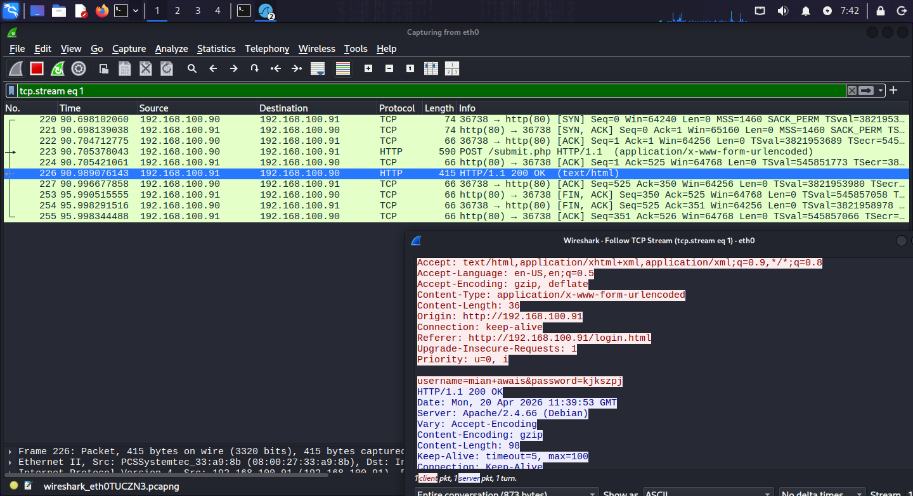

# 🔓 HTTP — Port 80 | Practical Lab

**Author:** Muhammad Awais Javed (Mian Awais) · **Date:** April 2026 · **Part of:** [SOC-Journey-2026](https://github.com/awaisjaved-soc/SOC-Journey-2026)

---

## 📌 Table of Contents

- [🎯 Objective](#-objective)
- [📖 What is HTTP?](#-what-is-http)
- [⚙️ How It Works](#️-how-it-works)
- [🧪 Lab Environment](#-lab-environment)
- [💻 Commands Used](#-commands-used)
- [🔍 Wireshark Analysis](#-wireshark-analysis)
- [🚨 SOC Analyst Notes](#-soc-analyst-notes)
- [🛡️ MITRE ATT&CK](#️-mitre-attck)
- [📸 Screenshots](#-screenshots)
- [✅ Key Takeaways](#-key-takeaways)

---

## 🎯 Objective

To set up a realistic-looking web login page served over **plain HTTP**, submit credentials through it, and capture them in Wireshark — proving why HTTP is dangerous and what credential theft looks like at packet level in a SOC environment.

---

## 📖 What is HTTP?

**HTTP = HyperText Transfer Protocol.** It's the foundation of the web — the request/response protocol browsers use to load pages, submit forms, and talk to servers. It runs on **port 80** by default.

### The Core Problem

HTTP was designed for **open information sharing, not security**:
- **No encryption** — everything travels in plaintext: URLs, headers, cookies, form data, passwords.
- **No identity verification** — the client can't be sure the server is who it claims to be (no certificates).
- **Stateless** — each request is independent; sessions are tracked with cookies, which are also sent in plaintext.

### HTTP vs HTTPS at a Glance

| | HTTP (port 80) | HTTPS (port 443) |
|---|---|---|
| **Encryption** | None — plaintext | TLS encryption |
| **Credentials in Wireshark** | Fully readable | Encrypted gibberish |
| **Server identity** | Not verified | Verified via certificate |
| **SOC visibility** | Everything visible | Only metadata (SNI, IPs, timing) |

---

## ⚙️ How It Works

A login over HTTP, at packet level:

```
Browser (192.168.100.90)                        Apache (192.168.100.91:80)
        |                                                  |
        | --- TCP handshake (SYN, SYN-ACK, ACK) ---------> |
        | --- GET /login.html ---------------------------> |
        | <--- 200 OK (login page HTML) ------------------ |
        | --- POST /submit.php -------------------------> |
        |     username=awais&password=Secret123           |
        |     (VISIBLE IN PLAINTEXT)                     |
        | <--- 200 OK (response page) ------------------- |
```

1. Browser opens a TCP connection to port 80 (3-way handshake).
2. `GET /login.html` fetches the login form.
3. User submits the form → browser sends `POST /submit.php` with the credentials in the **request body, unencrypted**.
4. Anyone capturing the traffic (same Wi-Fi, a tap, MITM position) reads `username=...&password=...` directly.

---

## 🧪 Lab Environment

| Machine | Role | IP |
|---|---|---|
| Kali Linux | Apache2 + PHP web server, Wireshark capture | `192.168.100.91` |
| Same machine / another VM | Victim browser submitting the login form | `192.168.100.90` |

**Tools:** Kali Linux · Apache2 · PHP · Wireshark

---

## 💻 Commands Used

Every command I ran, with what each one does:

```bash
sudo apt update
```
Updates the package list so `apt` knows the latest available software versions.

```bash
sudo apt install apache2 php libapache2-mod-php -y
```
Installs the **Apache2** web server, **PHP**, and the Apache PHP module so the server can run my `submit.php` page.

```bash
sudo systemctl start apache2
```
Starts the Apache web server right now.

```bash
sudo systemctl enable apache2
```
Makes Apache start automatically on boot (persistence for the lab environment).

```bash
sudo nano /var/www/html/login.html
```
Creates the fake login page in Apache's web root (`/var/www/html/` — the folder Apache serves files from). I pasted in a modern styled login form:

```html
<!DOCTYPE html>
<html lang="en">
<head>
    <meta charset="UTF-8">
    <meta name="viewport" content="width=device-width, initial-scale=1.0">
    <title>Secure Access - Enterprise System</title>
    <style>
        * { margin: 0; padding: 0; box-sizing: border-box; }
        body {
            font-family: 'Segoe UI', Tahoma, Geneva, Verdana, sans-serif;
            background: linear-gradient(135deg, #0f172a 0%, #1e2937 100%);
            height: 100vh;
            display: flex;
            align-items: center;
            justify-content: center;
            overflow: hidden;
        }
        .login-container {
            background: rgba(255, 255, 255, 0.98);
            padding: 45px 40px;
            border-radius: 20px;
            box-shadow: 0 20px 40px rgba(0, 0, 0, 0.3);
            width: 400px;
            text-align: center;
            animation: fadeInScale 0.8s ease forwards;
        }
        @keyframes fadeInScale {
            from { opacity: 0; transform: scale(0.85); }
            to { opacity: 1; transform: scale(1); }
        }
        h2 {
            color: #1e2937;
            margin-bottom: 35px;
            font-size: 28px;
            font-weight: 600;
            position: relative;
        }
        h2::after {
            content: '';
            position: absolute;
            width: 60px;
            height: 3px;
            background: #3b82f6;
            bottom: -10px;
            left: 50%;
            transform: translateX(-50%);
            border-radius: 3px;
        }
        input {
            width: 100%;
            padding: 16px 18px;
            margin: 14px 0;
            border: 2px solid #e2e8f0;
            border-radius: 10px;
            font-size: 16px;
            transition: all 0.4s ease;
        }
        input:focus {
            border-color: #3b82f6;
            box-shadow: 0 0 0 4px rgba(59, 130, 246, 0.15);
            transform: translateY(-2px);
        }
        button {
            width: 100%;
            padding: 16px;
            margin-top: 25px;
            background: linear-gradient(135deg, #3b82f6, #2563eb);
            color: white;
            border: none;
            border-radius: 10px;
            font-size: 17px;
            font-weight: 600;
            cursor: pointer;
            transition: all 0.4s ease;
            position: relative;
            overflow: hidden;
        }
        button:hover {
            background: linear-gradient(135deg, #2563eb, #1d4ed8);
            transform: translateY(-3px);
            box-shadow: 0 12px 25px rgba(59, 130, 246, 0.4);
        }
        button::before {
            content: '';
            position: absolute;
            top: -50%;
            left: -100%;
            width: 50%;
            height: 200%;
            background: linear-gradient(120deg, rgba(255,255,255,0) 30%, rgba(255,255,255,0.6) 50%, rgba(255,255,255,0) 70%);
            transition: 0.7s;
        }
        button:hover::before {
            left: 200%;
        }
        .footer-text {
            margin-top: 30px;
            font-size: 14px;
            color: #64748b;
        }
        .logo { font-size: 42px; margin-bottom: 10px; }
    </style>
</head>
<body>
    <div class="login-container">
        <div class="logo">🔒</div>
        <h2>Enterprise Secure Login</h2>
        <form action="/submit.php" method="POST">
            <input type="text" name="username" placeholder="Username or Email" required>
            <input type="password" name="password" placeholder="Password" required>
            <button type="submit">Sign In Securely</button>
        </form>
        <p class="footer-text">SOC Lab Environment • All traffic is monitored</p>
    </div>
</body>
</html>
```

The irony is intentional: the page *looks* professional and even says "Secure" — but it's served over plain HTTP.

```bash
sudo nano /var/www/html/submit.php
```
Creates the form handler — the page the browser `POST`s the credentials to:

```php
<?php
if($_POST) {
    $username = htmlspecialchars($_POST['username']);
    $password = htmlspecialchars($_POST['password']);
?>
<!DOCTYPE html>
<html lang="en">
<head>
    <meta charset="UTF-8">
    <title>Login Response</title>
    <style>
        body {
            font-family: 'Segoe UI', sans-serif;
            background: linear-gradient(135deg, #0f172a 0%, #1e2937 100%);
            height: 100vh;
            display: flex;
            align-items: center;
            justify-content: center;
            color: white;
        }
        .card {
            background: rgba(255,255,255,0.97);
            color: #1e2937;
            padding: 50px 40px;
            border-radius: 20px;
            box-shadow: 0 20px 50px rgba(0,0,0,0.3);
            width: 440px;
            text-align: center;
            animation: popIn 0.6s ease forwards;
        }
        @keyframes popIn {
            from { opacity: 0; transform: scale(0.7); }
            to { opacity: 1; transform: scale(1); }
        }
        h2 { color: #10b981; margin-bottom: 25px; font-size: 26px; }
        p { font-size: 18px; margin: 18px 0; color: #334155; }
    </style>
</head>
<body>
    <div class="card">
        <h2>✅ Login Captured Successfully</h2>
        <p><strong>Username:</strong> <?php echo $username; ?></p>
        <p><strong>Password:</strong> <?php echo $password; ?></p>
        <p style="margin-top:35px; color:#64748b; font-size:15px;">
            This is a controlled SOC Analyst lab.<br>
            In real environments, sending credentials over HTTP is extremely dangerous.
        </p>
    </div>
</body>
</html>
<?php
}
?>
```

```bash
sudo systemctl restart apache2
```
Restarts Apache so the new pages are served correctly.

**The attack simulation:**
1. Opened Wireshark → selected `eth0` (real network traffic) or `lo` (loopback).
2. Started the capture.
3. In a browser, went to `http://192.168.100.91/login.html` (from the same machine or another VM).
4. Entered a username and password → clicked **Sign In Securely**.

---

## 🔍 Wireshark Analysis

**Useful display filters:**

| Filter | What it shows |
|---|---|
| `tcp.port == 80` | All HTTP traffic |
| `http.request.method == POST` | Form submissions — where the credentials live |
| `http contains "password"` | Direct credential search across packets |
| `tcp.port == 80 && ip.addr == 192.168.100.90` | Traffic from the specific victim IP |

**What to look for in the capture:**
- In the `POST /submit.php` packet, expand the **HTML Form URL Encoded** section — you'll clearly see `username=xxx&password=yyy` in **plaintext**.
- The `Referer` header shows which page the user came from (`/login.html`).
- `Follow → TCP Stream` on the session shows the full login like a readable transcript — request headers, credentials, and the server's response page.

---

## 🚨 SOC Analyst Notes

**How attackers abuse HTTP:**
- **Credential sniffing** — anyone on the same network segment (open Wi-Fi, compromised switch, ARP spoofing position) passively collects logins from HTTP traffic. This is exactly what I simulated.
- **Phishing pages over HTTP** — fake login portals (like my lab page) harvest credentials; the lack of a certificate warning context makes some users less suspicious.
- **Session hijacking** — cookies and session tokens also travel in plaintext, so attackers steal sessions without ever knowing the password.
- **MITM content injection** — plaintext responses can be modified in transit (malicious scripts injected into legitimate pages).

**What to monitor / alert on:**
- Any **authentication traffic over port 80** — credentials should never travel unencrypted; flag it immediately.
- `http contains "password"` style detections on network sensors.
- Internal applications still serving login forms over HTTP — these are findings, not just observations.
- A sudden appearance of HTTP `POST`s to external IPs with form data → possible data being sent to a phishing/exfil server.

---

## 🛡️ MITRE ATT&CK

| Technique | ID | Relevance |
|---|---|---|
| Network Sniffing | [T1040](https://attack.mitre.org/techniques/T1040/) | Capturing credentials from plaintext HTTP traffic |
| Adversary-in-the-Middle | [T1557](https://attack.mitre.org/techniques/T1557/) | Intercepting/modifying unencrypted web traffic |
| Input Capture | [T1056](https://attack.mitre.org/techniques/T1056/) | Harvesting keystrokes/credentials via fake login forms |

---

## 📸 Screenshots

| Screenshot | What it shows |
|---|---|
|  | Wireshark capture of the HTTP login — credentials visible in plaintext |

---

## ✅ Key Takeaways

- HTTP sends **everything in plaintext** — I watched my own submitted username and password appear in Wireshark's packet details.
- A login page can *look* completely professional ("Enterprise Secure Login" 🔒) and still be insecure — **the padlock that matters is in the URL bar** (`https://`), not on the page.
- As an analyst: `http.request.method == POST` + `http contains "password"` is a quick way to hunt for credential exposure, and any login over port 80 is a finding worth reporting.
- This is exactly why modern applications must use **HTTPS (Port 443)** — see my [HTTPS lab](../Https-443-tcp/).
