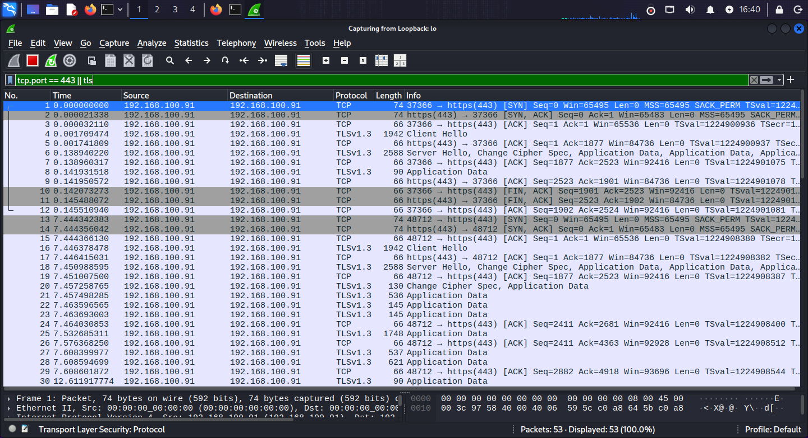

# 🔒 HTTPS — Port 443 | Practical Lab

**Author:** Muhammad Awais Javed (Mian Awais) · **Date:** April 2026 · **Part of:** [SOC-Journey-2026](https://github.com/awaisjaved-soc/SOC-Journey-2026)

---

## 📌 Table of Contents

- [🎯 Objective](#-objective)
- [📖 What is HTTPS?](#-what-is-https)
- [⚙️ How It Works](#️-how-it-works)
- [🧪 Lab Environment](#-lab-environment)
- [💻 Commands Used](#-commands-used)
- [🔍 Wireshark Analysis](#-wireshark-analysis)
- [🚨 SOC Analyst Notes](#-soc-analyst-notes)
- [🛡️ MITRE ATT&CK](#️-mitre-attck)
- [📸 Screenshots](#-screenshots)
- [✅ Key Takeaways](#-key-takeaways)

---

## 🎯 Objective

To set up an HTTPS web server with a modern login page, then capture and analyze the **TLS-encrypted** traffic in Wireshark — from both the local machine and another device (phone/laptop) — to learn exactly what a SOC analyst **can and cannot see** once traffic is encrypted.

---

## 📖 What is HTTPS?

**HTTPS = HTTP Secure.** It's plain HTTP wrapped in **TLS (Transport Layer Security)** encryption, running on **port 443**. Everything between the client and server — URLs, headers, cookies, form data, passwords — is encrypted before it hits the network.

### What TLS Gives You (That HTTP Lacks)

| Protection | How |
|---|---|
| **Confidentiality** | Symmetric encryption of all application data after the handshake |
| **Server identity** | The server proves who it is with a **certificate** (browser shows the padlock) |
| **Integrity** | Tampering with encrypted data in transit breaks decryption — modifications are detected |

### TLS Handshake in 30 Seconds

1. **Client Hello** — browser says hi, lists the TLS versions and cipher suites it supports.
2. **Server Hello** — server picks a cipher, sends its **certificate** (identity proof).
3. **Key exchange** — both sides securely agree on session keys (nobody watching can derive them).
4. **Encrypted session** — from here on, everything (including the login `POST`) is ciphertext.

> In my HTTP lab, Wireshark showed `username=xxx&password=yyy` in clear text. In this lab, the same login shows only encrypted blobs.

---

## ⚙️ How It Works

The same login as the HTTP lab — but wrapped in TLS:

```
Browser                                            Apache (192.168.100.91:443)
  |                                                        |
  | --- TCP handshake ----------------------------------> |
  | --- Client Hello (TLS versions, ciphers) ------------> |
  | <--- Server Hello + Certificate --------------------- |
  | --- Key exchange -----------------------------------> |
  | ======== ENCRYPTED TUNNEL ESTABLISHED =============== |
  | --- [encrypted] GET /login.html -------------------> |
  | <--- [encrypted] login page ------------------------ |
  | --- [encrypted] POST username & password -----------> |
  |     (NOT readable — ciphertext only)                 |
```

**What stays visible:** source/destination IPs, port 443, the **SNI** (Server Name Indication — the domain being visited, sent in plaintext during Client Hello), certificate details, packet sizes and timing.
**What becomes invisible:** URLs, headers, cookies, form fields, passwords.

---

## 🧪 Lab Environment

| Machine | Role | IP |
|---|---|---|
| Kali Linux | Apache2 + PHP + TLS web server, Wireshark capture | `192.168.100.91` |
| Phone / laptop | Second victim device submitting the login form | `192.168.100.61` |

**Tools:** Kali Linux · Apache2 · PHP · OpenSSL (self-signed certificate) · Wireshark

---

## 💻 Commands Used

Every command I ran, with what each one does:

```bash
sudo apt update
```
Updates the package list so `apt` knows the latest available software versions.

```bash
sudo apt install apache2 php libapache2-mod-php openssl -y
```
Installs Apache2, PHP, the Apache PHP module, and **OpenSSL** (needed to generate the TLS certificate).

```bash
sudo a2enmod ssl
```
Enables Apache's **SSL module** — this is what lets Apache speak TLS/HTTPS at all.

```bash
sudo a2enmod rewrite
```
Enables the **rewrite module** (useful for redirecting HTTP → HTTPS and URL rules).

```bash
sudo systemctl start apache2
```
Starts the Apache web server right now.

```bash
sudo systemctl enable apache2
```
Makes Apache start automatically on boot.

```bash
sudo openssl req -x509 -nodes -days 365 -newkey rsa:2048 \
-keyout /etc/ssl/private/apache-selfsigned.key \
-out /etc/ssl/certs/apache-selfsigned.crt
```
Generates a **self-signed TLS certificate** — the identity document Apache will present to browsers:
- `-x509` → output a self-signed certificate (not a CSR)
- `-nodes` → don't encrypt the private key with a passphrase (so Apache can read it unattended)
- `-days 365` → certificate valid for one year
- `-newkey rsa:2048` → generate a new 2048-bit RSA key pair
- `-keyout` → where the private key is saved
- `-out` → where the certificate is saved

```bash
sudo nano /etc/apache2/sites-available/default-ssl.conf
```
Opens Apache's default HTTPS virtual-host config so the certificate paths and port 443 settings can be pointed at the new cert.

```bash
sudo a2ensite default-ssl.conf
```
Enables the HTTPS site configuration (tells Apache to actually serve port 443).

```bash
sudo systemctl restart apache2
```
Restarts Apache so the SSL module, certificate, and HTTPS site all take effect.

```bash
sudo systemctl status apache2
```
Checks that Apache is running cleanly with no config errors — always verify after touching TLS config.

**Testing the HTTPS login page:**
Opened a browser and visited `https://192.168.100.91/login.html`, accepting the self-signed certificate warning (expected — browsers don't trust self-signed certs, which is fine for a lab).

---

## 🔍 Wireshark Analysis

**Capture setup:**

For the **local machine (loopback)**, display filter:
```
tcp.port == 443 || tls
```

For **another device (phone / laptop)**, replace with the actual IP:
```
ip.addr == 192.168.100.61 && (tls || tcp.port == 443)
```

**Important TLS filters:**

| Filter | What it shows |
|---|---|
| `tls` | All TLS traffic |
| `tls.handshake.type == 1` | **Client Hello** — start of every TLS session |
| `tls.handshake.extensions_server_name` | **SNI** — the domain being visited, still in plaintext |
| `tls.app_data` | The encrypted application data (unreadable payloads) |

**What to look for in the capture:**
1. Find the **Client Hello** (`tls.handshake.type == 1`) — expand it and read the SNI field: the visited domain leaks here even though everything else is encrypted.
2. Follow the handshake: Server Hello → Certificate → key exchange → then only `Application Data` packets.
3. Select any `Application Data` packet after the handshake — the bytes are ciphertext. Compare this with my HTTP lab where the same login showed `username=xxx&password=yyy` in clear text.
4. From the phone's capture (`192.168.100.61`), confirm the same pattern: visible handshake metadata, invisible credentials.

---

## 🚨 SOC Analyst Notes

**What encryption takes away — and what it leaves:**
- **Gone:** URLs, credentials, cookies, request bodies — content inspection is dead on TLS 1.2+ without decryption.
- **Still visible:** source/destination IPs, SNI (the domain!), certificate issuer/details, JA3/JA4 TLS fingerprints, packet sizes, timing, and flow patterns.

**How attackers abuse HTTPS:**
- **Encrypted C2** — malware beacons over HTTPS (port 443) because it blends into normal web traffic and firewalls almost never block it.
- **Domain fronting / trusted services** — hiding C2 behind legitimate CDNs and cloud domains via SNI tricks.
- **Malicious certificates** — phishing sites with valid DV certificates (the padlock only proves encryption, **not** legitimacy).

**What to monitor / alert on:**
- **SNI mismatches** — SNI says `google.com` but the certificate belongs to something else.
- **Self-signed or suspicious certificates** on internal servers.
- **JA3 fingerprint anomalies** — known-malware TLS client fingerprints (e.g., Cobalt Strike's default JA3).
- **Beaconing patterns** — perfectly regular intervals + consistent byte counts to one external IP over 443.
- **Newly observed external 443 destinations** with no corresponding business need.

---

## 🛡️ MITRE ATT&CK

| Technique | ID | Relevance |
|---|---|---|
| Application Layer Protocol: Web Protocols | [T1071.001](https://attack.mitre.org/techniques/T1071/001/) | C2 hidden in ordinary HTTPS traffic |
| Encrypted Channel | [T1573](https://attack.mitre.org/techniques/T1573/) | Symmetric/asymmetric crypto hiding C2 and exfil |
| Adversary-in-the-Middle | [T1557](https://attack.mitre.org/techniques/T1557/) | TLS interception with rogue certificates |

---

## 📸 Screenshots

| Screenshot | What it shows |
|---|---|
|  | Wireshark capture of the TLS session — handshake visible, application data encrypted |

---

## ✅ Key Takeaways

- HTTPS (TLS on port 443) encrypts everything after the handshake — my login credentials were **unreadable** in Wireshark, unlike the HTTP lab.
- But encryption isn't invisibility: **SNI, certificates, JA3 fingerprints, and traffic patterns** are still gold for a SOC analyst.
- I generated a self-signed cert with OpenSSL, enabled Apache's SSL module, and watched a real TLS handshake packet-by-packet.
- The analyst's mindset shift: with HTTP you read the content; with HTTPS you read the **metadata and behavior**.
