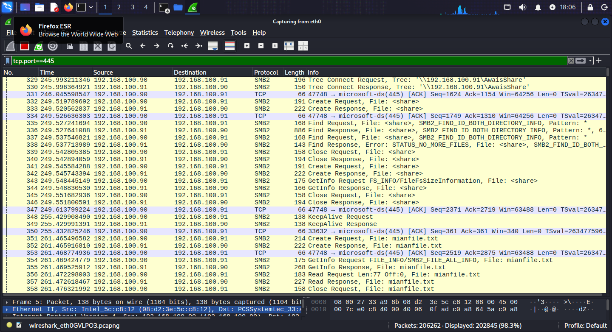
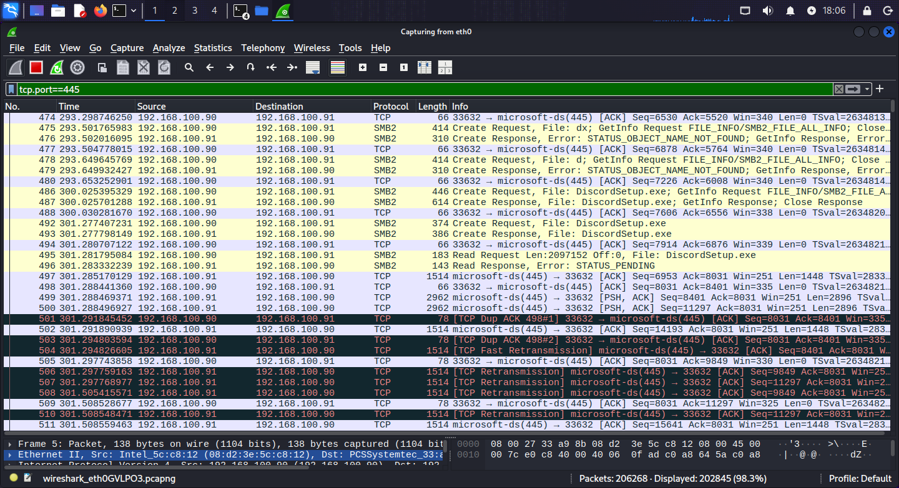
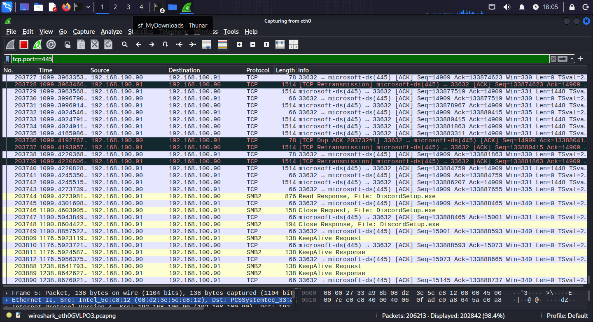

# 📁 SMB — Port 445 | Practical Lab

**Author:** Muhammad Awais Javed (Mian Awais)
**Date:** May 2026
**Part of:** [SOC-Journey-2026](https://github.com/awaisjaved-soc/SOC-Journey-2026)

---
## 📌 Table of Contents
- [🎯 Objective](#-objective)
- [📖 What is SMB?](#-what-is-smb)
- [⚙️ How It Works](#️-how-it-works)
- [🧪 Lab Environment](#-lab-environment)
- [💻 Commands Used](#-commands-used)
- [🔍 Wireshark Analysis](#-wireshark-analysis)
- [🚨 SOC Analyst Notes](#-soc-analyst-notes)
- [🛡️ MITRE ATT&CK](#️-mitre-attck)
- [📸 Screenshots](#-screenshots)
- [✅ Key Takeaways](#-key-takeaways)

---
## 🎯 Objective

- Set up a **Samba file share** on Linux from scratch
- Upload and download files over SMB, then watch it happen in Wireshark
- See the difference between **plaintext SMB** and **encrypted SMB (SMB3)**
- Learn why port 445 is one of the most watched ports in any SOC

---
## 📖 What is SMB?

**SMB (Server Message Block)** is the protocol Windows networks use for **file and printer sharing**. Older versions were called CIFS. Modern SMB runs on **TCP port 445** (the old NetBIOS ports 137–139 are legacy).

### SMB versions

| Version | Notes |
|---------|-------|
| SMBv1 / CIFS | Ancient, insecure — home of **EternalBlue** (WannaCry). Must be disabled everywhere. |
| SMBv2 | Faster, still common |
| SMBv3 | Adds **encryption** and secure negotiation — the only version you should allow |

### Real-life example

When you open `\\fileserver\shared` on a Windows machine and drag a file into it — that's SMB on port 445 doing the work.

---
## ⚙️ How It Works

```
[ Client ]                               [ SMB Server :445 ]
    |                                               |
    |-- 1. Negotiate Protocol (dialect) ----------->|
    |<-- 2. Negotiate Response (agree SMB3) --------|
    |-- 3. Session Setup (NTLM authenticate) ------>|
    |<-- 4. Session Setup Response (OK) ------------|
    |-- 5. Tree Connect (attach to share) --------->|
    |-- 6. Create / Read / Write (file ops) ------->|
    |<-- 7. Responses + Close ----------------------|
```

1. **Negotiate** — client and server agree on an SMB dialect
2. **Session Setup** — authentication (usually NTLM)
3. **Tree Connect** — attach to the named share (`AwaisShare`)
4. **File operations** — create, read, write, delete

---
## 🧪 Lab Environment

| Role | Machine | IP |
|------|---------|----|
| SMB Server (Samba) | Kali VM | `192.168.100.91` |
| Client | Laptop Kali VM | `192.168.100.90` |

- **SMB user:** `mianawais` (Linux + Samba user) — **password:** `mian`
- **Share name:** `AwaisShare` → `/srv/samba/AwaisShare`

---
## 💻 Commands Used

### Server side (`192.168.100.91`) — full setup

```bash
# 1. Update packages and install the Samba server
sudo apt update
sudo apt install samba -y
```

```bash
# 2. Create the Linux user (set the password when asked — I used 'mian')
sudo adduser mianawais
```

```bash
# 3. Add the user to Samba's database and enable the account (password: mian)
sudo smbpasswd -a mianawais
sudo smbpasswd -e mianawais
```

```bash
# 4. Create the shared folder with correct ownership and permissions
sudo mkdir -p /srv/samba/AwaisShare
sudo chown -R mianawais:mianawais /srv/samba/AwaisShare
sudo chmod -R 770 /srv/samba/AwaisShare
```
> The `chown`/`chmod` step avoids "Permission denied" errors when writing to the share.

```bash
# 5. Edit the Samba configuration
sudo nano /etc/samba/smb.conf
```

Add this at the end of the file:

```ini
[AwaisShare]
   path = /srv/samba/AwaisShare
   browsable = yes
   writable = yes
   guest ok = no
   force user = mianawais
   create mask = 0664
   directory mask = 0775
   force create mode = 0664
   force directory mode = 0775
```
> Save with `Ctrl+O` → Enter → `Ctrl+X`.

```bash
# 6. Restart Samba and confirm it is running
sudo systemctl restart smbd
sudo systemctl status smbd
```

### Uploading files to the share

```bash
# Method 1 — copy directly on the server
sudo cp ~/Downloads/anyfile.exe /srv/samba/AwaisShare/
```

```bash
# Method 2 — upload from the client with smbclient, then inside the prompt:
smbclient //192.168.100.91/AwaisShare -U mianawais
# smb: \> put anyfile.exe
```

### Downloading files to the client

```bash
# Method 1 — download with smbclient, then inside the prompt:
smbclient //192.168.100.91/AwaisShare -U mianawais
# smb: \> get anyfile.exe
```

```bash
# Method 2 — mount the share (best for large files), then copy
sudo mkdir -p /mnt/AwaisShare
sudo mount -t cifs //192.168.100.91/AwaisShare /mnt/AwaisShare -o username=mianawais,password=mian,vers=3.0
cp /mnt/AwaisShare/filename.exe ~/
```

### Cleaning up — delete files, share, user

```bash
# Delete one file from the share
sudo rm /srv/samba/AwaisShare/filename.exe

# Delete the whole share folder
sudo rm -r /srv/samba/AwaisShare
```

```bash
# Remove a user from Samba, then delete the Linux account
sudo smbpasswd -x mianawais
sudo userdel -r mianawais
```
> To remove the share itself: delete the `[AwaisShare]` section from `smb.conf`, then `sudo systemctl restart smbd`.

### Fixing the permission issues I hit

```bash
# Fix ownership of one file
sudo chown mianawais:mianawais /srv/samba/AwaisShare/filename.exe

# Check who owns what
ls -la /srv/samba/AwaisShare/

# Go to the share folder
cd /srv/samba/AwaisShare
```

```bash
# Fix ownership of ALL files at once, including root-owned ones
sudo chown mianawais:mianawais /srv/samba/AwaisShare/*
```
> I hit this with `Wireshark-4.6.4-x64.exe` and `nmap-7.98-setup.exe` — they were root-owned after copying, so the SMB user couldn't touch them:
```bash
sudo chown mianawais:mianawais /srv/samba/AwaisShare/Wireshark-4.6.4-x64.exe
sudo chown mianawais:mianawais /srv/samba/AwaisShare/nmap-7.98-setup.exe

# Strip the restrictive ACL entries from the files
sudo setfacl -b /srv/samba/AwaisShare/Wireshark-4.6.4-x64.exe
sudo setfacl -b /srv/samba/AwaisShare/nmap-7.98-setup.exe

# Or fix everything in one go — ownership + remove bad ACLs
sudo chown mianawais:mianawais /srv/samba/AwaisShare/*
sudo setfacl -b /srv/samba/AwaisShare/*
```

### Nmap — fingerprint the SMB service

```bash
# Basic check that 445 is open
nmap -p 445 192.168.100.91

# Version detection plus SMB enumeration scripts (OS, security mode)
nmap -p 445 -sV --script smb-os-discovery,smb-security-mode 192.168.100.91
```

### Enabling SMB encryption (SMB3)

To force encryption, I added this `[global]` section to `smb.conf`:

```ini
[global]
   workgroup = WORKGROUP
   server string = Kali SMB Server
   netbios name = kali
   security = user
   map to guest = bad user
   smb encrypt = required
   server min protocol = SMB3
   server max protocol = SMB3
   client min protocol = SMB3
   client max protocol = SMB3
   log level = 3
   dns proxy = no
```
> `smb encrypt = required` + SMB3-only protocols means every byte on the wire is encrypted.

---
## 🔍 Wireshark Analysis

On the **client**: open Wireshark → select `eth0` → start capture → upload/download a file → stop capture.

**Display filters:**

```
tcp.port == 445
```
> All SMB traffic.

```
smb
```
> SMB protocol packets only.

```
ntlmssp
```
> The authentication (Session Setup) packets.

### What to look for

**Key packets in order:** Negotiate Protocol → Session Setup (NTLM) → Tree Connect → Create / Read / Write → Close.

**Plaintext vs encrypted — the big lesson of this lab:**

| Mode | What you see in Wireshark |
|------|---------------------------|
| Encryption **disabled** | File **names**, share names, and content metadata are readable — you can literally see which file is being transferred |
| Encryption **enabled** (`smb encrypt = required`, SMB3) | Only encrypted blobs — you see the packet flow and sizes, but no filenames or content |

> With encryption off, a large file transfer shows up as a big burst of readable SMB packets. With encryption on, it's the same burst — but opaque.

---
## 🚨 SOC Analyst Notes

**How attackers abuse SMB:**
- **Lateral movement** — the classic Windows admin-share path (`\\target\C$`, `\\target\ADMIN$`) once credentials are stolen
- **Ransomware** — many strains spread machine-to-machine over SMB (EternalBlue made SMBv1 infamous)
- **Data theft** — plaintext SMB leaks filenames, folder structures, and file contents to anyone sniffing the network
- **Relaying** — NTLM authentication over SMB can be relayed to other machines (NTLM relay attacks)

**What to monitor / alert on:**
- Port **445** traffic between workstations (servers talking to servers is normal; workstation-to-workstation SMB is suspicious)
- SMBv1 negotiation attempts — should not exist on a modern network
- Mass file reads/writes over SMB in a short window (possible ransomware)
- Windows Event IDs **4624** (type 3 = network logon), **5140/5145** (share access), **4697/7045** (service installs — persistence via SMB)

---
## 🛡️ MITRE ATT&CK

| Technique | ID | Relevance |
|-----------|----|-----------|
| Remote Services: SMB/Windows Admin Shares | T1021.002 | Lateral movement via admin shares |
| Lateral Tool Transfer | T1570 | Moving tools/malware host-to-host over SMB |
| Data from Network Shared Drive | T1039 | Reading sensitive files from shares |
| Exploitation of Remote Services | T1210 | EternalBlue-style SMBv1 exploitation |

---
## 📸 Screenshots

| Screenshot | Description |
|------------|-------------|
|  | SMB session startup — Negotiate Protocol and Session Setup packets |
|  | File operation request — Create/Write sequence for the transfer |
|  | Server responses and session teardown after the transfer |

---
## ✅ Key Takeaways

- SMB (TCP 445) is how Windows shares files — negotiate, authenticate (NTLM), connect to the share, transfer.
- **Without encryption, filenames and transfer details are visible in Wireshark.** With `smb encrypt = required` + SMB3, the same transfer is opaque.
- Permission pain is real: `chown`/`setfacl` fixes on the server side are part of the job, and I hit them with real files.
- For a SOC, port 445 is a crown-jewel monitoring target: lateral movement, ransomware spread, and data theft all ride on it.
