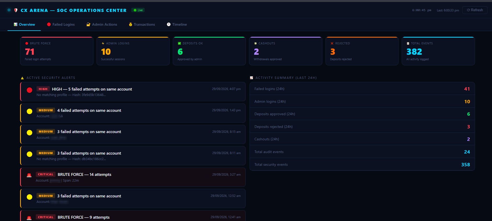
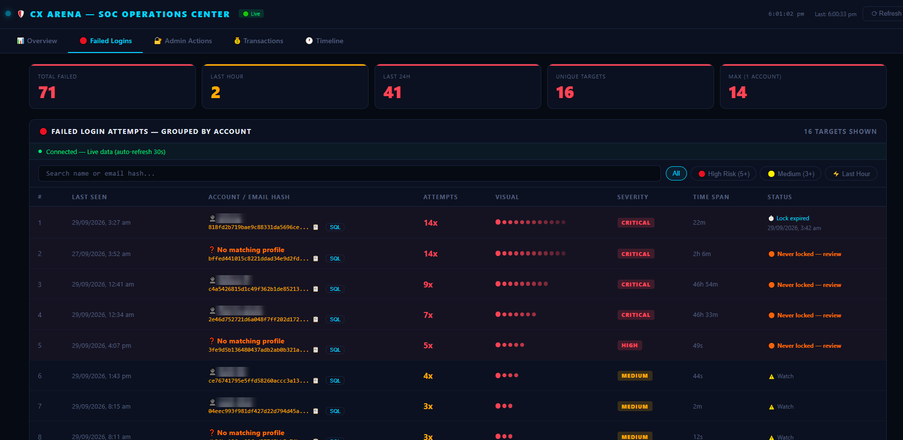
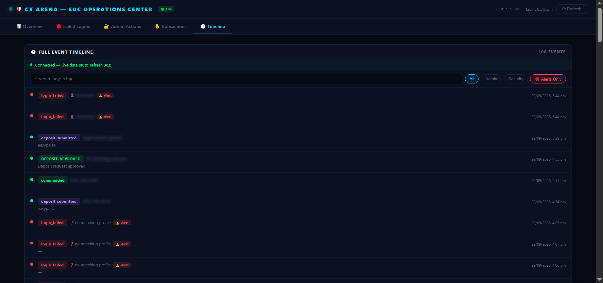

# 🛡️ Muhammad Awais Javed

### Aspiring SOC Analyst (L1 / L2) · Blue Team · Detection & Investigation

*Hands-on labs. Real event logs. Documented investigations.*

---

## 👋 About Me

I'm a self-taught cybersecurity student from Pakistan, building a career as a **SOC Analyst**. I learn by doing: every topic in this repository comes from a lab I built, an attack or activity I generated, and the logs and packets I investigated afterwards.

I'm not just reading about detections. I'm **generating the events, finding them in the logs, and writing down what an analyst should look for.**

- 🎯 **Goal:** SOC Analyst L1 / L2 (Blue Team)
- 🧪 **Method:** Build a lab → generate activity → investigate → document
- 📚 **Learning path:** Event Logs ✅ → SIEM (Wazuh ✅ · Splunk next) → TryHackMe SOC path → Detection engineering
- 🤝 **Open to:** SOC internships and junior Blue Team roles

---

## 📂 Projects

> 👉 **Click any project name to open its folder.**

| # | Project | What it covers | Key skills |
|---|---------|----------------|------------|
| 1 | ### [🪟 Windows Event Logs Analysis](./Windows%20Event%20Logs%20analysis) | 90+ Windows Security event IDs across 8 categories, each with a lab, detection logic and SOC importance | Event log analysis, threat detection, Sysmon, Active Directory |
| 2 | ### [🌐 Common Ports & Protocols](./Common-port-and-protocols) | Practical Wireshark and lab analysis of the protocols a SOC analyst sees every day | Packet analysis, Wireshark, Nmap, network forensics |
| 3 | ### [📊 Web App Security Dashboard](./Web-App-Security-Dashboard) | A SOC-style monitoring dashboard I built for a live website to investigate its security and admin logs | Log investigation, brute-force detection, timeline analysis |
| 4 | ### [🔀 TCP & UDP Explained](./tcp%20and%20udp%20explained) | Fundamentals of TCP and UDP behaviour, handshakes and traffic differences | Networking fundamentals |
| 5 | ### [🏠 Wazuh Home SOC Lab](./Wazuh-Home-SOC-Lab) | Working SIEM: Wazuh 4.14.5 on Docker (Kali) monitoring a Windows Server 2022 DC — full install guide plus 4 detection labs, every alert triaged | SIEM deployment, detection engineering, alert triage, MITRE ATT&CK |

---

## 🪟 Project 1: Windows Event Logs Analysis

Systematic, hands-on analysis of Windows Security events in a **Windows Server 2022 Active Directory** lab (VirtualBox). Each event includes the lab used to generate it, what it means, and how a SOC analyst should respond.

| Category | Folder | Highlights |
|----------|--------|------------|
| 🔐 Logon & Authentication | [Open](./Windows%20Event%20Logs%20analysis/Logon%20%26%20Authentication%20events) | 4624, 4625, 4648, 4672, 4768, 4769, 4771, 4776 |
| 👤 Account Management | [Open](./Windows%20Event%20Logs%20analysis/Account%20Management%20Events) | 4720, 4724, 4728, 4732-series, 4740, 4756, plus a privilege escalation lab |
| ⚙️ Process & System | [Open](./Windows%20Event%20Logs%20analysis/Process-and-System-Events) | 4688, 4698, 4697, 7045, 4103/4104 PowerShell, WMI persistence (5857–5861) |
| 🧹 Audit & Log Tampering | [Open](./Windows%20Event%20Logs%20analysis/Audit%20Log%20Tampering) | 1102, 1100, 4719, 4739, 4906, 4907 |
| 🔥 Network & Firewall | [Open](./Windows%20Event%20Logs%20analysis/Network-Firewall-Events) | 5156, 5157, 5152, 5154, 5158, 4946, 4947, 4948, 4954 |
| 🔑 Privilege Use | [Open](./Windows%20Event%20Logs%20analysis/Privilege%20Use%20Events) | 4673, 4674 |
| 🔍 Sysmon | [Open](./Windows%20Event%20Logs%20analysis/Sysmon-Events) | Event IDs 1, 3, 7, 10, 11, 22 |

**Lab environment:** Windows Server 2022 · Active Directory · VirtualBox · Sysmon

---

## 🌐 Project 2: Common Ports & Protocols

Each protocol was captured, analysed and documented: how it normally behaves, how it is abused, and what it looks like in a packet capture.

| Protocol | Folder |
|----------|--------|
| DNS (53/UDP) | [Open](./Common-port-and-protocols/DNS-protocol-53-UDP) |
| FTP | [Open](./Common-port-and-protocols/FTP-protocol) |
| HTTP (80/TCP) | [Open](./Common-port-and-protocols/HTTP-port-80-tcp) |
| HTTPS (443/TCP) | [Open](./Common-port-and-protocols/Https-443-tcp) |
| LDAP (389/TCP) | [Open](./Common-port-and-protocols/LDAP-TCP-389) · [On Windows Server](./Common-port-and-protocols/LDAP-USING-WINDOWS-SERVER) |
| RDP (3389/TCP) | [Open](./Common-port-and-protocols/RDP-TCP-3389) |
| SMB (445/TCP) | [Open](./Common-port-and-protocols/SMB-protocol-tcp-445) |
| SMTP / Telnet (25) | [Open](./Common-port-and-protocols/SMTP-TELNET-port-25) |
| SSH / SFTP (22) | [Open](./Common-port-and-protocols/Secure-shell-SSH-SFTP-port-22) |
| DHCP | [Explained](./Common-port-and-protocols/dhcp-explained) · [Practical](./Common-port-and-protocols/dhcp-practical) |
| Kerberos (88) | [Open](./Common-port-and-protocols/kerberos-port88) |

---

## 📊 Project 3: Web App Security Dashboard

A SOC-style monitoring dashboard I built for a tournament website, so I could investigate its security and admin logs the way an analyst would, instead of reading raw database rows.

> *Not a web development project. The goal was detection and investigation: what can I see, what can I catch, and what is missing from the logs.*

**Views:** Overview · Failed Logins · Admin Actions · Timeline

| Overview | Failed Logins | Timeline |
|:---:|:---:|:---:|
|  |  |  |

*Sensitive data is blurred.* → [**View full project**](./Web-App-Security-Dashboard)

---

## 🏠 Project 5: Wazuh Home SOC Lab

A complete working home SOC: **Wazuh 4.14.5 SIEM** (Docker, on Kali Linux) with a **Windows Server 2022 domain controller** enrolled as agent 001. I deployed the stack, attacked my own lab, and triaged every alert like an analyst on shift.

**Build guide:** [Installation & Configuration](./Wazuh-Home-SOC-Lab/00-Wazuh-SIEM-Installation-and-Configuration/) — every command explained (Docker, certificates, agent install, Kerberos, static IPs)

| Lab | Scenario | Key events |
|-----|----------|------------|
| [01 — RDP Logon Detection](./Wazuh-Home-SOC-Lab/01-RDP-Logon-Detection-4624-4625/) | RDP logons as a domain user, reading 4624/4625 like an analyst | 4624, 4625 |
| [02 — Privilege Escalation](./Wazuh-Home-SOC-Lab/02-Privilege-Escalation-Detection-4728-4729/) | Account added to a privileged group, then removed | 4728, 4729 |
| [03 — Account Lifecycle](./Wazuh-Home-SOC-Lab/03-Account-Lifecycle-Auditing-4720-to-4740/) | Create → disable → enable → delete, plus a real account lockout | 4720, 4725, 4722, 4726, 4740, 4767 |
| [04 — Brute-Force Triage](./Wazuh-Home-SOC-Lab/04-Brute-Force-Mini-Incident-Triage/) | Failures → lockout → unlock → success, worked as a SOC case with a written verdict | 4625, 4740, 4767, 4624 |

**What it taught me:** pivoting investigations on source IP, telling false positives from real attacks (Wazuh flagged my own logon as possible pass-the-hash), finding a Kerberos 4771 logging blind spot, and tuning — the SIEM's own compliance scanner tripped its own detection rule.

→ [**View full project**](./Wazuh-Home-SOC-Lab)

---

## 🧰 Skills & Tools

| Area | Tools / Topics |
|------|----------------|
| **Log Analysis** | Windows Event Viewer, Security/System/PowerShell logs, Sysmon |
| **SIEM** | Wazuh 4.14.5 — Docker deployment, agent enrollment & troubleshooting, alert triage, rule tuning, MITRE ATT&CK mapping |
| **Network Analysis** | Wireshark, Nmap, TCP/UDP, DNS, DHCP, Kerberos, SMB, LDAP, RDP |
| **Environment** | Windows Server 2022, Active Directory, VirtualBox, Linux |
| **Concepts** | Brute-force detection, persistence, privilege escalation, log tampering, lateral movement |
| **Documentation** | Markdown, GitHub, evidence-based lab write-ups |

---

## 🗺️ Roadmap

- [x] Networking and protocol labs
- [x] Windows Event Log analysis (all 8 categories, including Sysmon)
- [x] Web app log monitoring dashboard
- [x] SIEM: Wazuh 4.14.5 home SOC lab (Docker + Windows Server 2022 agent, 4 detection labs triaged)
- [ ] SIEM: Splunk, Snort
- [ ] Custom Wazuh detection rules (1102 audit-log-cleared, louder 4728)
- [ ] TryHackMe SOC path (SAL1 → SEC0 → SEC1)
- [ ] Malware analysis basics

---

## 📫 Let's Connect

I'm actively looking for **SOC Analyst / Blue Team opportunities**.

- 💼 [LinkedIn: Muhammad Awais Javed](https://www.linkedin.com/in/muhammad-awais-javed-287bb43b9)
- 🧠 [TryHackMe: awaisjaved7141](https://tryhackme.com/p/awaisjaved7141)
- 💻 [GitHub: awaisjaved-soc](https://github.com/awaisjaved-soc)

*⭐ If you find these labs useful, feel free to star the repo.*

