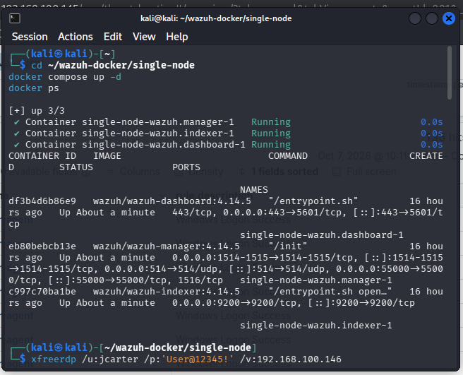
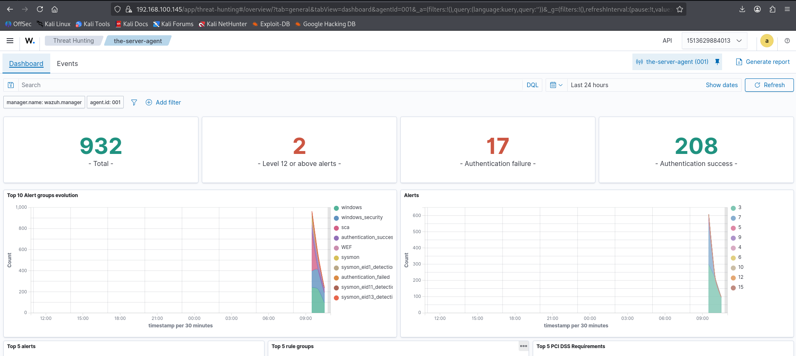
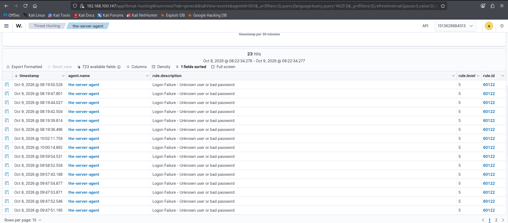

# Wazuh SIEM — Installation & Configuration (Docker on Kali + Windows Server 2022 Agent)

## Overview

| Field | Details |
|---|---|
| Objective | Deploy a working Wazuh SIEM and connect a Windows Server 2022 agent, end to end |
| SIEM | Wazuh 4.14.5 single-node (Docker Compose) |
| SIEM host | Kali Linux 2026.2 (VirtualBox) → static `192.168.100.50` |
| Monitored host | Windows Server 2022, domain controller `soclab.local` → static `192.168.100.146` |
| Agent | Wazuh agent 4.14.5 (`the-server-agent`, ID 001) |
| Network | VirtualBox host-only/NAT network `192.168.100.0/24` |

## Architecture

```
┌─────────────────────────┐         1514/tcp (agent events)
│  Kali Linux 2026.2      │         1515/tcp (enrollment)
│  192.168.100.50         │ ◄──────────────────────────┐
│                         │                            │
│  ┌───────────────────┐  │         443/tcp (dashboard)│
│  │ wazuh.indexer-1   │  │                            │
│  │ wazuh.manager-1   │  │                    ┌───────┴──────────────┐
│  │ wazuh.dashboard-1 │  │                    │ Windows Server 2022  │
└─────────────────────────┘                    │ WIN-SOCLAB           │
                                               │ 192.168.100.146      │
                    ▲                          │ soclab.local (DC)    │
                    │ https://192.168.100.50   │ agent ID 001         │
                    │                          └──────────────────────┘
                 Analyst
               (browser)
```

---

## Step 1 — Install Docker on Kali

**What this does:** installs the Docker engine and Compose plugin, which will run the three Wazuh containers.

> ⚠️ **Kali gotcha:** Docker's official install script detects Kali and adds a `kali-rolling` repository that **does not exist** on Docker's servers (404 errors). Fix: add the **Debian `bookworm`** repository manually instead — Kali 2026.x is bookworm-based and it works perfectly.

```bash
# Prerequisites for adding an external APT repository
sudo apt update
sudo apt install -y ca-certificates curl gnupg
```

```bash
# Create a keyring directory and import Docker's GPG key
# (so APT can verify packages really came from Docker)
sudo install -m 0755 -d /etc/apt/keyrings
curl -fsSL https://download.docker.com/linux/debian/gpg | sudo gpg --dearmor -o /etc/apt/keyrings/docker.gpg
sudo chmod a+r /etc/apt/keyrings/docker.gpg
```

```bash
# Add Docker's Debian BOOKWORM repo (not kali-rolling — that one 404s)
echo "deb [arch=$(dpkg --print-architecture) signed-by=/etc/apt/keyrings/docker.gpg] https://download.docker.com/linux/debian bookworm stable" \
  | sudo tee /etc/apt/sources.list.d/docker.list > /dev/null
```

```bash
# Install the engine + Compose plugin, then verify
sudo apt update
sudo apt install -y docker-ce docker-ce-cli containerd.io docker-buildx-plugin docker-compose-plugin
sudo docker --version        # expect: Docker 29.x
docker compose version       # expect: v5.x
```

---

## Step 2 — Raise `vm.max_map_count`

**What this does:** the Wazuh indexer (OpenSearch) memory-maps large index files. The Linux default limit is too low and the indexer container will crash-loop without this.

```bash
# Apply immediately ...
sudo sysctl -w vm.max_map_count=262144

# ... and persist it across reboots
echo "vm.max_map_count=262144" | sudo tee -a /etc/sysctl.conf
```

---

## Step 3 — Deploy the Wazuh single-node stack

**What this does:** clones Wazuh's official Docker deployment, generates the TLS certificates the three components use to talk to each other, then starts indexer + manager + dashboard.

```bash
# Clone the official deployment repo
git clone https://github.com/wazuh/wazuh-docker.git
cd wazuh-docker/single-node
```

```bash
# Generate self-signed certs for indexer/manager/dashboard communication
# (the generator container runs once and exits — it only creates files)
docker compose -f generate-indexer-certs.yml run --rm generator
```

```bash
# Start all three containers in the background
docker compose up -d
```

```bash
# Verify: all three must show "Running"
docker ps
```

Expected output — three healthy containers:



> 💡 **After any reboot**, just re-run `docker compose up -d` from `~/wazuh-docker/single-node`. Containers listen on all interfaces, so they survive host IP changes — only the *agent* cares about the manager's IP (see Step 9).

---

## Step 4 — Open the dashboard

**What this does:** the dashboard container publishes HTTPS on the Kali host's port 443.

- URL: `https://192.168.100.50` (use Kali's current IP; after Step 9 it's always `.50`)
- Username: `admin` · Password: `SecretPassword` (defaults — **change these**)
- Your browser will warn about the self-signed certificate — accept it, it's yours.

What a healthy Threat Hunting view looks like:





---

## Step 5 — Install the Wazuh agent on Windows Server 2022

**What this does:** downloads the Windows agent MSI and installs it silently, telling it the manager's address at install time. Run in an **elevated** PowerShell.

```powershell
# Download the agent (match the manager version: 4.14.5)
Invoke-WebRequest -Uri https://packages.wazuh.com/4.x/windows/wazuh-agent-4.14.5-1.msi `
  -OutFile "$env:TEMP\wazuh-agent.msi"
```

```powershell
# Silent install, pointing at the manager
msiexec.exe /i "$env:TEMP\wazuh-agent.msi" /q WAZUH_MANAGER="192.168.100.50"
```

```powershell
# Confirm the service exists, then start it
Get-Service WazuhSvc
NET START Wazuh
```

> 📝 **Alternative (used during troubleshooting):** install first, then edit the manager address directly in
> `C:\Program Files (x86)\ossec-agent\ossec.conf` (`<address>192.168.100.50</address>` inside `<client><server>`),
> **verify the edit with** `Select-String "<address>" ossec.conf`, then `NET STOP Wazuh` / `NET START Wazuh`.
> The verify step matters — a silent failed edit once cost an hour of debugging.

---

## Step 6 — Verify the agent is Active

**What this does:** confirms the agent enrolled (port 1515) and is shipping events (port 1514).

1. Dashboard → **Agents** → `the-server-agent` (ID 001) should show **Active**.
2. On the server, check the agent's own log if anything looks wrong:
   ```powershell
   Get-Content "C:\Program Files (x86)\ossec-agent\ossec.log" -Tail 20
   ```
   The log says exactly why it can't connect (wrong IP, refused, key issues) — always read it before guessing.
3. Quick network check from the server:
   ```powershell
   Test-NetConnection 192.168.100.50 -Port 1514   # must be TcpTestSucceeded: True
   ```

---

## Step 7 — Kerberos on Kali (for domain RDP)

**What this does:** lets Kali authenticate to the domain with Kerberos instead of falling back to NTLM, so `xfreerdp` logons behave like real domain clients.

`/etc/krb5.conf`:

```ini
[libdefaults]
    default_realm = SOCLAB.LOCAL
    dns_lookup_realm = false
    dns_lookup_kdc = false

[realms]
    SOCLAB.LOCAL = {
        kdc = 192.168.100.146
        admin_server = 192.168.100.146
    }

[domain_realm]
    .soclab.local = SOCLAB.LOCAL
    soclab.local = SOCLAB.LOCAL
```

RDP as a domain user afterwards:

```bash
xfreerdp /u:jcarter /d:soclab.local /p:'User@12345!' /v:192.168.100.146 /cert:ignore
```

---

## Step 8 — Static IPs (killing the DHCP gremlin)

**What this does:** stops VirtualBox DHCP from reassigning Kali's address on reboot — which once silently disconnected the agent for an entire session.

**Kali → `192.168.100.50`:**

```bash
nmcli con show   # note the connection name, e.g. "Wired connection 1"
sudo nmcli con mod "Wired connection 1" ipv4.method manual \
  ipv4.addresses 192.168.100.50/24 ipv4.gateway 192.168.100.1 ipv4.dns 192.168.100.1
sudo nmcli con down "Wired connection 1" && sudo nmcli con up "Wired connection 1"
ip -4 addr show  # confirm 192.168.100.50/24
```

**Windows Server → `192.168.100.146` (static, same address):**

```powershell
Set-NetIPInterface -InterfaceAlias "Ethernet" -Dhcp Disabled
New-NetIPAddress -InterfaceAlias "Ethernet" -IPAddress 192.168.100.146 `
  -PrefixLength 24 -DefaultGateway 192.168.100.1
Set-DnsClientServerAddress -InterfaceAlias "Ethernet" -ServerAddresses 192.168.100.1
ipconfig   # confirm .146, gateway .1
```

Then repoint the agent at Kali's final address **once**, verify, restart:

```powershell
NET STOP Wazuh
(Get-Content "C:\Program Files (x86)\ossec-agent\ossec.conf") `
  -replace '192.168.100.147','192.168.100.50' | Set-Content "C:\Program Files (x86)\ossec-agent\ossec.conf"
Select-String "<address>" "C:\Program Files (x86)\ossec-agent\ossec.conf"
NET START Wazuh
```

Final addresses (write them down — everything else references these):

| Host | IP | Role |
|---|---|---|
| Kali (Wazuh) | `192.168.100.50` | SIEM + attacker box |
| WIN-SOCLAB | `192.168.100.146` | DC + Wazuh agent 001 |
| Gateway/DNS | `192.168.100.1` | VirtualBox |

---

## Troubleshooting notes (all hit during this build)

| Symptom | Cause | Fix |
|---|---|---|
| `docker compose up` → indexer crash-loops | `vm.max_map_count` too low | Step 2 |
| Agent shows Disconnected, log shows old IP | Kali DHCP changed the IP | Step 8 (static IPs) |
| Agent log: `Unable to connect to [IP]:1514` | Wrong `<address>` in ossec.conf or edit didn't apply | Re-edit, **verify with `Select-String`**, restart service |
| RDP: "To sign in remotely, you need the right…" | GPO edit *replaced* the RDP-users list, removing Administrators | GPMC → Default Domain Controllers Policy → add **Administrators** back to "Allow log on through Remote Desktop Services" → `gpupdate /force` |
| RDP: "Connect a smart card" | "Smart card is required" got flipped (ADUC account flag or GPO) | Boot DSRM → `HKLM\...\Policies\System\ScForceOption = 0` → reboot → uncheck the flag |
| Dashboard won't load | Containers stopped, or `http://` instead of `https://` | `docker compose up -d`; always use `https://` |

---

## Next steps

- [ ] Install **Sysmon** on the server and add its channel to `ossec.conf`:
  ```xml
  <localfile>
    <location>Microsoft-Windows-Sysmon/Operational</location>
    <log_format>eventchannel</log_format>
  </localfile>
  ```
- [ ] Write **custom detection rules** (starting with 1102 audit-log-cleared, then a louder 4728 for privileged groups)
- [ ] Change the default dashboard credentials
- [ ] Enable the `wazuh-archives` index (`logall_json`) for full event retention
