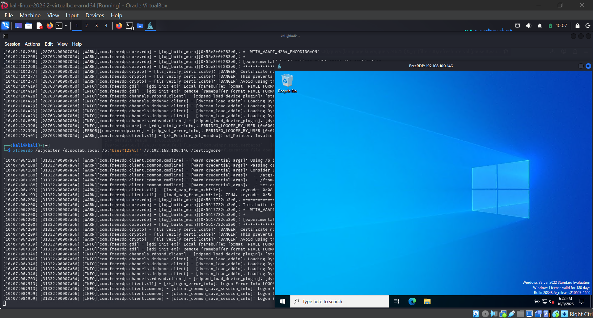
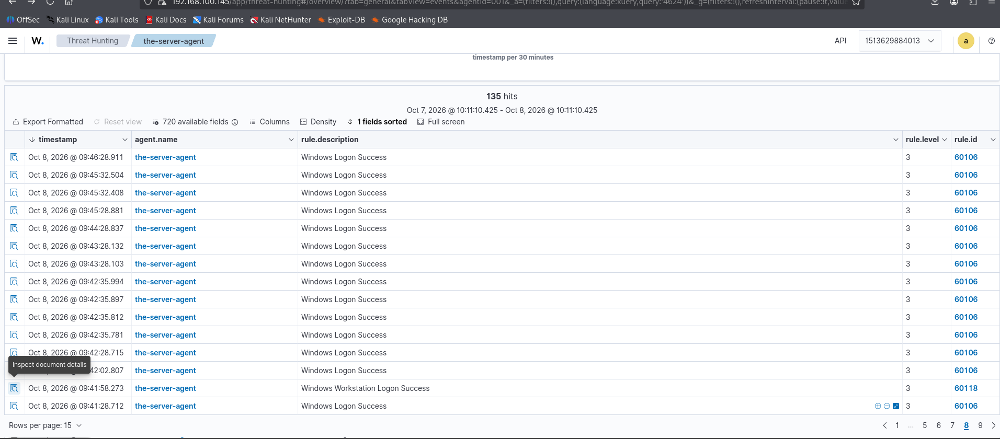

# Lab 1 — RDP Logon Monitoring (4624 / 4625)

## Overview

| Field | Details |
|---|---|
| Objective | Generate real RDP logons as a domain user and watch 4624/4625 flow into Wazuh |
| Event IDs | 4624 (successful logon), 4625 (failed logon) |
| Log | Security |
| Attacker box | Kali `192.168.100.50` → RDP to `192.168.100.146` |
| Test account | `SOCLAB\jcarter` |
| SOC Importance | 🟢 High — logons are the first indicator an attacker gained access |
| MITRE ATT&CK | T1021.001 (Remote Desktop Protocol), T1078 (Valid Accounts) |

## What Is This Lab?

The most basic detection scenario in existence: someone logs in remotely. Before this lab, every event in the SIEM said `Administrator`. Now the lab has a *population* — and telling **who** did **what**, **how**, and **from where** is the whole game. This lab proves the pipeline works: action on the endpoint → Windows event → Wazuh agent → manager → dashboard.

## Lab Steps

### Step 1 — RDP in as a domain user (generates 4624, Logon Type 10)

From Kali (Kerberos is configured per the installation guide):

```bash
xfreerdp /u:jcarter /d:soclab.local /p:'User@12345!' /v:192.168.100.146 /cert:ignore
```

**What this does:** opens a full Remote Desktop session as `jcarter`. The DC records **4624** with `LogonType: 10` (RemoteInteractive).



### Step 2 — Fail on purpose (generates 4625)

```bash
xfreerdp /u:jcarter /d:soclab.local /p:'WrongPassword!' /v:192.168.100.146 /cert:ignore
```

**What this does:** a failed logon records **4625** with `Status 0xC000006D` / `SubStatus 0xC000006A` (bad password for a *valid* username). Compare `0xC0000064` = "username doesn't even exist" — that distinction tells you whether the attacker is guessing *passwords* or guessing *usernames*.

### Step 3 — Find them in Wazuh

Threat Hunting → Events tab → search `4624`. Every success is here, 135 of them in one session:



Expand one alert and read it like an analyst:

| Field (`data.win.eventdata.*`) | Meaning | What to judge |
|---|---|---|
| `targetUserName` | **Who** logged on (`jcarter`) | Expected user? |
| `targetUserSid` | The SID (`…-1103`) — survives renames | Stronger identity than the name |
| `logonType` | **How** (`10` = RDP, `2` = console, `3` = network) | Remote vs local — spot the anomaly |
| `ipAddress` | **From where** (`192.168.100.50`) | Known workstation or unknown/external? |
| `logonProcessName` / `authenticationPackageName` | `User32` / `Negotiate` (Kerberos) | Auth mechanism |
| `targetLogonId` | Session ID (e.g. `0x6d687d`) | Correlate with the later **4634** logoff → session duration |
| `elevatedToken` | Was it elevated? (`%%1843` = No) | Privilege context |

Also compare the alert envelope: `data.win.system.systemTime` (when Windows recorded it) vs `@timestamp` (when Wazuh indexed it) — the gap is your **pipeline delay**. And `eventRecordID` lets you jump to the exact record in Event Viewer: chain of custody.

## What Wazuh Said on Its Own

- **Rule 92653** (level 3): *"User: SOCLAB\jcarter logged using Remote Desktop Connection (RDP) from ip:192.168.100.50"* — plain-English summary with MITRE mapping (T1021.001, T1078.002). Correct and calm.
- **Rule 92657** (level 6): *"Successful Remote Logon Detected — NTLM authentication, possible pass-the-hash attack."* A **false positive** in the lab (it was a legitimate password logon that fell back to NTLM) — but exactly the kind of alert an analyst triages daily: scary description, benign cause, and now you know *why* it fired.

## SOC Takeaways

- **Logon type is the first pivot**: type 10 (RDP) from an unexpected IP is the classic lateral-movement signal.
- **The IP is the master key**: every investigation starts by filtering all events from the source IP to scope the activity.
- **Sub-status codes separate password-guessing from username-guessing** (`006A` vs `0064`).
- **Session tracking**: link 4624 → 4634 via `targetLogonId` to measure how long an intruder stayed.
- **Severity ≠ certainty**: a level-6 "possible pass-the-hash" can be your own legitimate logon. Context decides.
