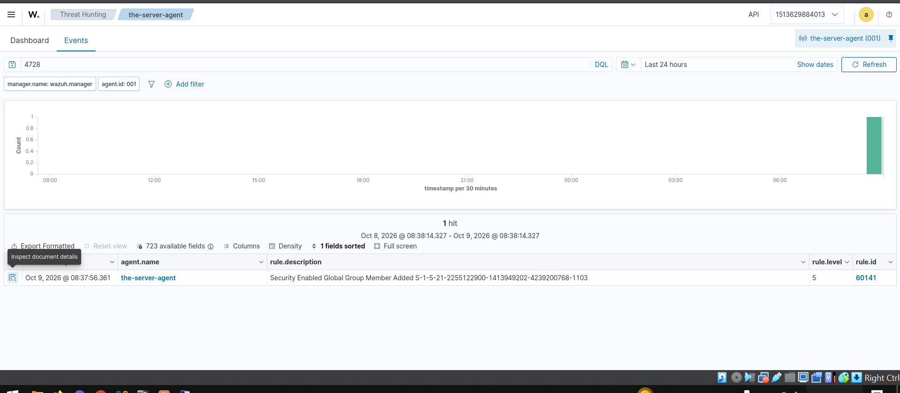
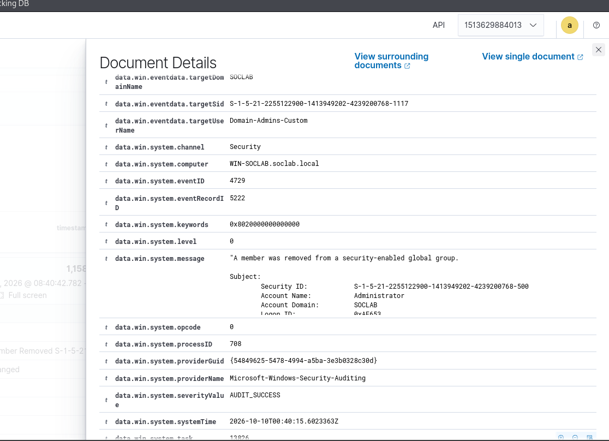
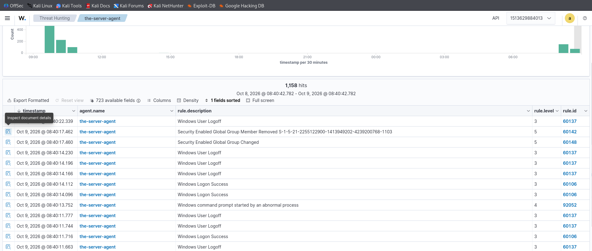
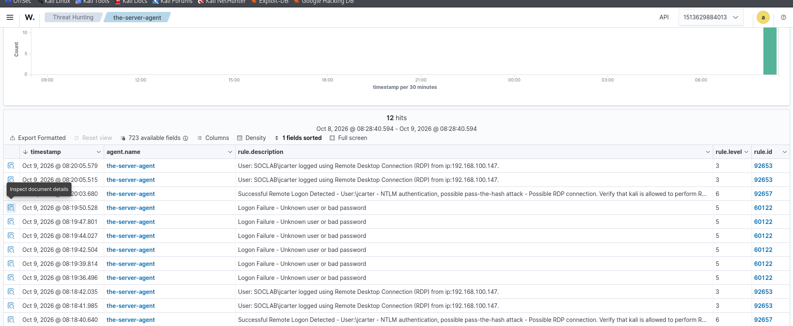
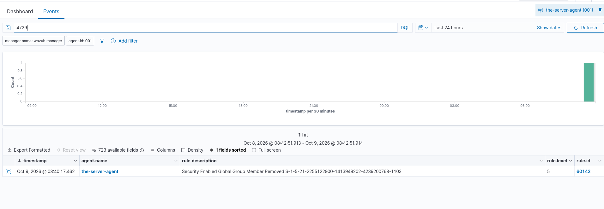

# Lab 2 — Privilege Escalation Detection (4728 / 4729)

## Overview

| Field | Details |
|---|---|
| Objective | Simulate the classic attack pattern: add a compromised account to a privileged group, then remove it |
| Event IDs | 4728 (member added to security-enabled global group), 4729 (member removed) |
| Log | Security |
| Test account | `SOCLAB\jcarter` → added to `Domain-Admins-Custom` |
| Actor | `SOCLAB\Administrator` (the "attacker" for this drill) |
| SOC Importance | 🟡 Medium-High — group membership changes are a top persistence/escalation signal |
| MITRE ATT&CK | T1098 (Account Manipulation), T1078 (Valid Accounts) |

## What Is This Lab?

One of the most common real attack patterns: compromise a low-privilege account, add it to a privileged group, do the damage, remove it to cover tracks. This lab generates both halves — the escalation (**4728**) and the cleanup (**4729**) — and watches what Wazuh thinks of them.

## Lab Steps

### Step 1 — The "attack": add jcarter to the privileged group

On the server (elevated PowerShell, as Administrator):

```powershell
Add-ADGroupMember -Identity "Domain-Admins-Custom" -Members "jcarter"
```

**What this does:** grants `jcarter` everything `Domain-Admins-Custom` can do. Windows logs **4728** on the DC. In Wazuh, search `4728`:



Wazuh's built-in **rule 60141** fires at **level 5**: *"Security Enabled Global Group Member Added S-1-5-21-…-1103."* Note it shows jcarter's **SID** (`…-1103`), not his name — SIDs never change, so they're the reliable identifier.

### Step 2 — Read the alert like an analyst

Expand the 4728 and answer the three questions:

| Question | Field | Answer in this drill |
|---|---|---|
| **Who was added?** | `memberName` / `memberSid` | `jcarter` (`…-1103`) |
| **To what?** | `targetUserName` = the **group** | `Domain-Admins-Custom` |
| **Who did it?** | `subjectUserName` | `Administrator` (SID `…-500`, the built-in admin) |

> ⚠️ **Field gotcha:** for 4728/4729, `targetUserName` is the **group name**, not the user — the user lives in `memberName`/`memberSid`. This trips up everyone the first time.

The analyst's real question is the third row: **was the subject authorized?** Here it's Administrator at a sane hour doing lab work — benign. In a SOC, a subject of `svc-backup` at 3 AM adding accounts to Domain Admins is your incident.

### Step 3 — The cleanup: remove him again (bonus 4729)

```powershell
Remove-ADGroupMember -Identity "Domain-Admins-Custom" -Members "jcarter" -Confirm:$false
```

**What this does:** revokes the membership, logging **4729**. Check its details — same field layout, subject still Administrator:





### Step 4 — Read the whole session timeline

The full story in one view — RDP logons, the 4728/4729 pair, logoffs, even a `92052` (command prompt started by an abnormal process, from the PowerShell work):





## The Detection Gap (why custom rules are next)

Wazuh gave a **privileged-group addition** only **level 5**. For `Domain-Admins-Custom`, you'd want that screaming louder — a custom rule that raises the level when the *target group* is privileged is exactly the next build. The gap between what the default ruleset thinks and what *you* think is where detection engineering lives.

## SOC Takeaways

- **4728 + 4729 close together** = escalation-then-cleanup pattern. Either event alone is interesting; the pair is a story.
- **Subject is the verdict**: who performed the change matters more than what changed.
- **SIDs over names**: `…-500` is always the built-in Administrator, `…-1103` is jcarter — even if someone renames the accounts.
- **Default rule levels are a starting point**, not a judgment. Tune them to your environment.
