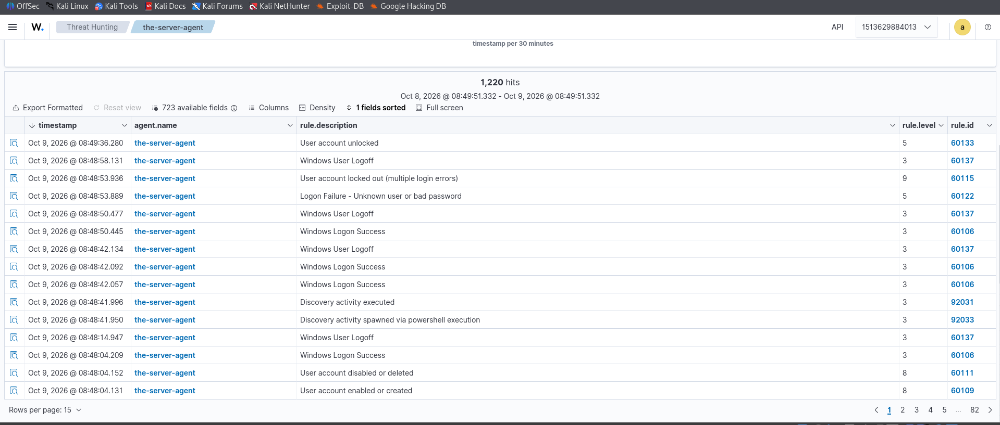
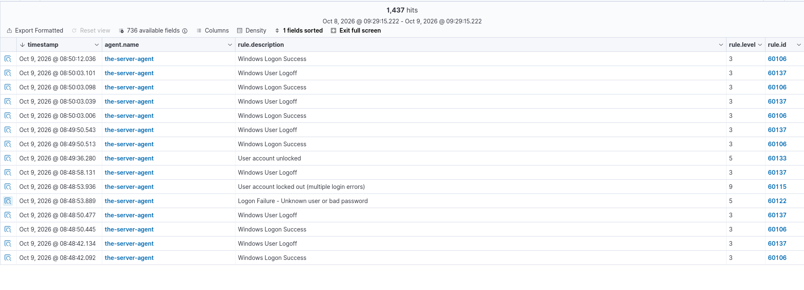
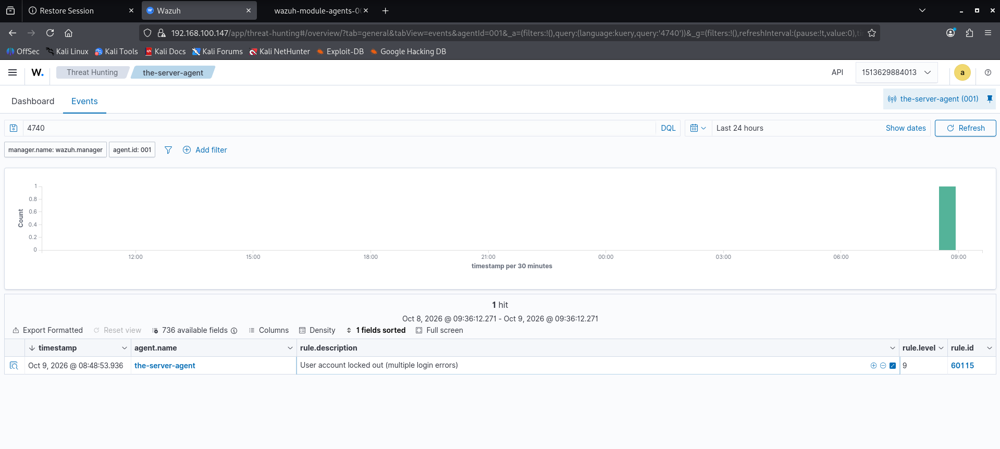
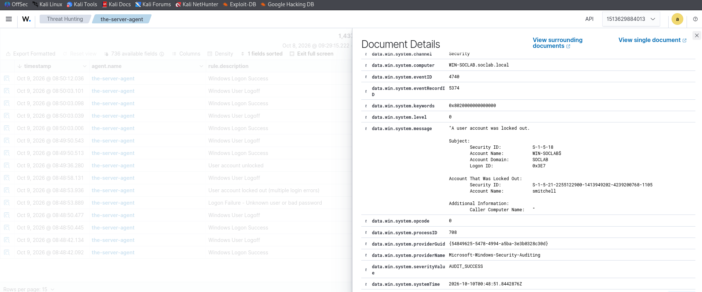
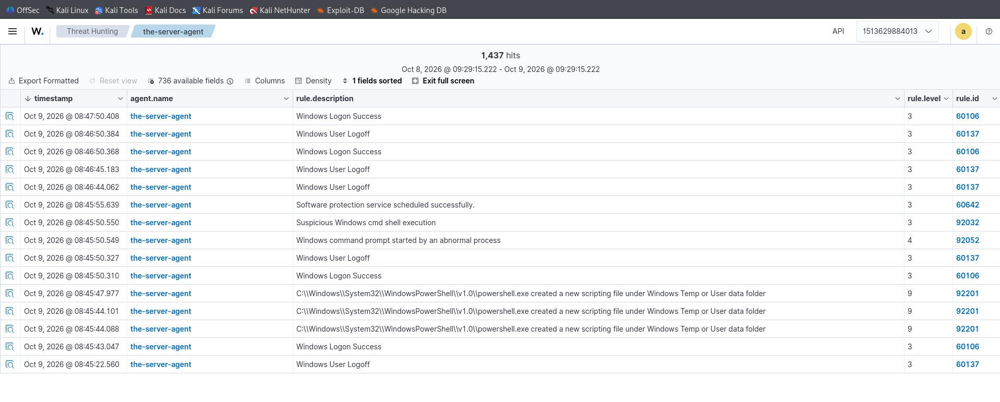

# Lab 3 — Account Lifecycle Auditing (4720 → 4725 → 4722 → 4726, 4740, 4767)

## Overview

| Field | Details |
|---|---|
| Objective | Trace a full account lifecycle — birth, disable, enable, death — plus a real lockout |
| Event IDs | 4720 (created), 4725 (disabled), 4722 (enabled), 4726 (deleted), 4740 (locked out), 4767 (unlocked) |
| Log | Security |
| Test accounts | `tempuser` (lifecycle), `SOCLAB\smitchell` (lockout) |
| SOC Importance | 🟢 High — rogue accounts and lockouts are daily SOC fare |
| MITRE ATT&CK | T1136 (Create Account), T1078 (Valid Accounts) |

## What Is This Lab?

Every account has a story: created → used → disabled → deleted. Attackers love creating backdoor accounts and disabling legitimate ones. This lab builds a complete lifecycle in four events, then generates a genuine **account lockout** — and along the way discovers a real logging blind spot.

## Lab Steps

### Step 0 — Enable lockout first (a fresh domain never locks accounts by default)

```powershell
net accounts /lockoutthreshold:5 /lockoutwindow:30 /lockoutduration:30
```

**What this does:** locks an account after 5 bad passwords in 30 minutes, for 30 minutes. (In production this lives in the Default Domain Policy GPO — this is the quick lab equivalent.)

### Step 1 — Birth, disable, enable, death (4720 / 4725 / 4722 / 4726)

```powershell
# Create tempuser (fires 4720)
$pass = ConvertTo-SecureString "Temp@12345!" -AsPlainText -Force
New-ADUser -Name "Temp User" -SamAccountName "tempuser" `
  -UserPrincipalName "tempuser@soclab.local" `
  -Path "OU=SOC-Users,DC=soclab,DC=local" `
  -AccountPassword $pass -Enabled $true

# Disable (4725), re-enable (4722), delete (4726)
Disable-ADAccount -Identity "tempuser"
Enable-ADAccount -Identity "tempuser"
Remove-ADUser -Identity "tempuser" -Confirm:$false
```

**What this does:** four lifecycle events for the same `targetUserName`, minutes apart — created → disabled → enabled → deleted. In Wazuh, filter `data.win.eventdata.targetUserName: tempuser` and read the story top to bottom:





### Step 2 — Lock out smitchell (4740)

From Kali — `+auth-only` authenticates without opening a desktop, so it's fast:

```bash
for i in {1..6}; do xfreerdp /u:smitchell /d:soclab.local /p:'WrongPass!' \
  /v:192.168.100.146 /cert:ignore +auth-only; done
```

**What this does:** six bad passwords → the 5-attempt threshold trips → **4740** fires and Wazuh raises **rule 60115** at **level 9** (*"User account locked out (multiple login errors)"*).

Verify and resurrect on the server (the unlock fires **4767**, a bonus event):

```powershell
Search-ADAccount -LockedOut | Select SamAccountName
Unlock-ADAccount -Identity smitchell
```





### Step 3 — The full session in Wazuh

Logons, logoffs, the lockout, the unlock, and the PowerShell activity that drove it all — one scrolling timeline:



## 🔍 Bonus Discovery — The Kerberos 4771 Blind Spot

Counting the bad attempts on the DC showed only **1 × 4625** — but the account *locked out*, which requires **5** bad evaluations. The missing four attempts used **Kerberos** (thanks to `krb5.conf`), and Kerberos pre-auth failures log as **4771**, not 4625 — but **only if the "Kerberos Authentication Service" audit subcategory is enabled**. It wasn't, so those failures counted toward lockout while leaving no trace.

Check yours:

```powershell
auditpol /get /subcategory:"Kerberos Authentication Service"
```

Fix:

```powershell
auditpol /set /subcategory:"Kerberos Authentication Service" /success:enable /failure:enable
```

**Why this matters:** if that subcategory is off on a real DC, Kerberos brute-forcing is *invisible in the logs* while still locking accounts. Attackers know this — password-spraying over Kerberos is quieter than over NTLM for exactly this reason. This blind spot was found by noticing a number didn't add up — that instinct *is* the job.

## SOC Takeaways

- **A lockout alone means nothing — the pattern is everything**: one user + own workstation IP = forgot password; one user + many attempts + unknown IP = brute force; many users + few attempts each + one IP = password spray. Same 4740, three different verdicts.
- **After lockout, failure codes change**: attempts past the threshold log `0xC0000234` (account locked) instead of `0xC000006A` (bad password) — the code *transition* is itself a brute-force fingerprint.
- **Wazuh shows alerts, not all events**: Threat Hunting queries the alerts index. For true counts, enable the archives index (`logall_json`) or count on the DC with `Get-WinEvent`.
- **Audit subcategories are a detection surface**: what isn't audited can't be detected. Verify, don't assume.
