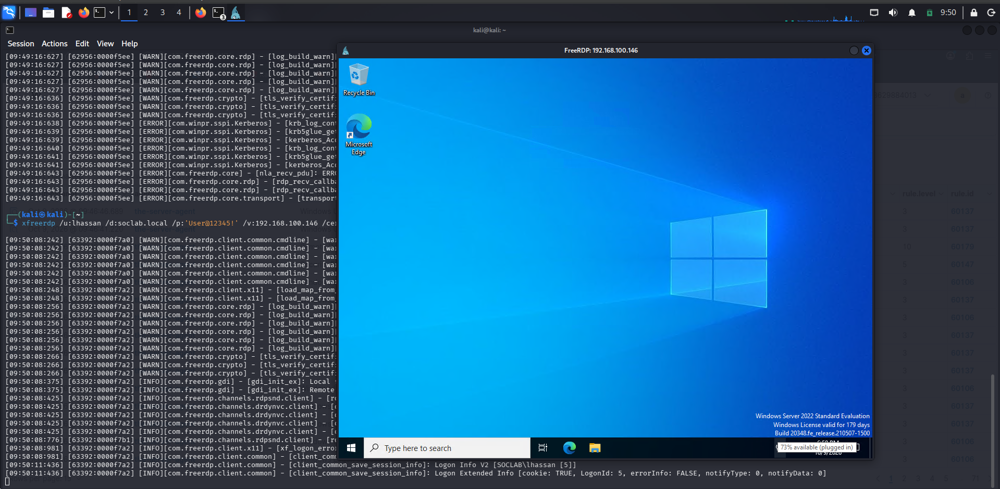
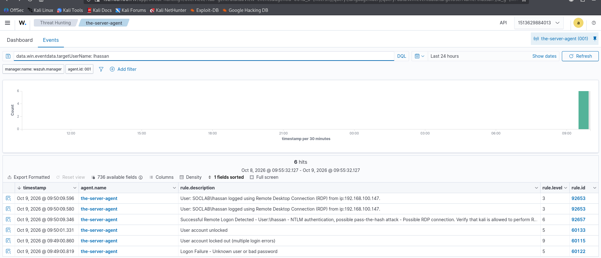

# Lab 4 — Brute-Force Mini-Incident: Triage Exercise (4625 → 4740 → 4767 → 4624)

## Overview

| Field | Details |
|---|---|
| Objective | Play SOC analyst on a realistic incident: failures → lockout → unlock → success |
| Event IDs | 4625 (failures), 4740 (lockout), 4767 (unlock), 4624 (success) |
| Log | Security |
| Test account | `SOCLAB\lhassan` |
| Attacker box | Kali `192.168.100.50` |
| SOC Importance | 🟢 High — fail→success sequences are the #1 brute-force triage pattern |
| MITRE ATT&CK | T1110.001 (Brute Force: Password Guessing) |

## What Is This Lab?

Everything so far was *generating* telemetry. This lab is *triaging* it. The drill: hammer `lhassan` with wrong passwords, unlock her, then log in successfully — then forget you did it and work the case like the analyst on shift who just got this queue item.

## Lab Steps

### Step 1 — Generate the incident (from Kali)

Five failures, fast (`+auth-only` authenticates without opening a desktop):

```bash
for i in {1..5}; do xfreerdp /u:lhassan /d:soclab.local /p:'WrongPass!' \
  /v:192.168.100.146 /cert:ignore +auth-only; done
```

Then one **real** logon with the correct password (lhassan needs RDP rights first):

```powershell
# on the server, if needed:
Add-ADGroupMember -Identity "Remote Desktop Users" -Members "lhassan"
```

```bash
# back on Kali:
xfreerdp /u:lhassan /d:soclab.local /p:'User@12345!' /v:192.168.100.146 /cert:ignore
# log her off afterwards: run `logoff` in her session
```



### Step 2 — Triage like you don't know the answer

In Wazuh Events, filter `data.win.eventdata.targetUserName: lhassan` and read the timeline top to bottom:



The sequence: **4625** (failure) → **4740** (locked out, rule 60115 @ level 9) → **4767** (unlocked, rule 60133) → **4624** (RDP success, rules 92653 + 92657). Answer in order:

1. **How many 4625s before the 4624?** What's the gap between first failure and success?
2. **What source IP?** Known machine in the environment, or unknown/external?
3. **What logon type was the success** — and does that type make sense for this user?
4. **Did Wazuh correlate**, or just fire individual 4625/4624 alerts? (Here: individual alerts + the lockout — no automatic "brute force succeeded" verdict. *You* are the correlation engine.)

### Step 3 — Write the verdict

One paragraph, argued **from the evidence alone** — as if the IP were unknown. Template:

> *At [time], [N] failed logons for lhassan originated from [IP] over [M] minutes, followed by a successful [type] logon from the same IP. [Assessment of whether the IP is expected]. Verdict: [brute-force success | legitimate user | inconclusive]. Recommended action: [force password reset / isolate host / close as benign …].*

The honest answer here is "my own drill" — but forcing the verdict from evidence, not from what you happen to know, is the entire analyst mindset. That discipline is what transfers to the SOC floor.

## SOC Takeaways

- **Failures → success from the same IP is the pattern that matters**, not any single event. One 4625 is noise; five 4625s + a 4624 is a case.
- **Time compression counts**: 5 failures in 60 seconds ≠ 5 failures across a week. Always check the window.
- **The unlock is part of the story**: 4767 tells you a human (or process) intervened — check *who* unlocked it and *why* before closing.
- **Know your ruleset's limits**: Wazuh fired per-event alerts but no "brute-force-then-success" correlation. Recognizing what your SIEM *doesn't* tell you is as important as reading what it does — and it's the motivation for custom correlation rules.
- **Pivot, scope, verdict**: IP → all its events → timeline → verdict. Every triage follows this motion.
