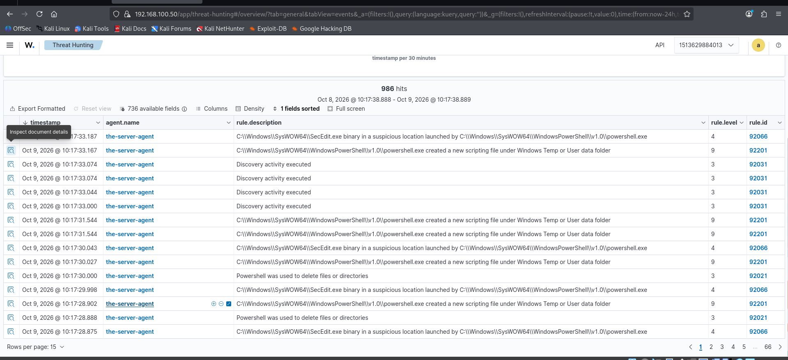
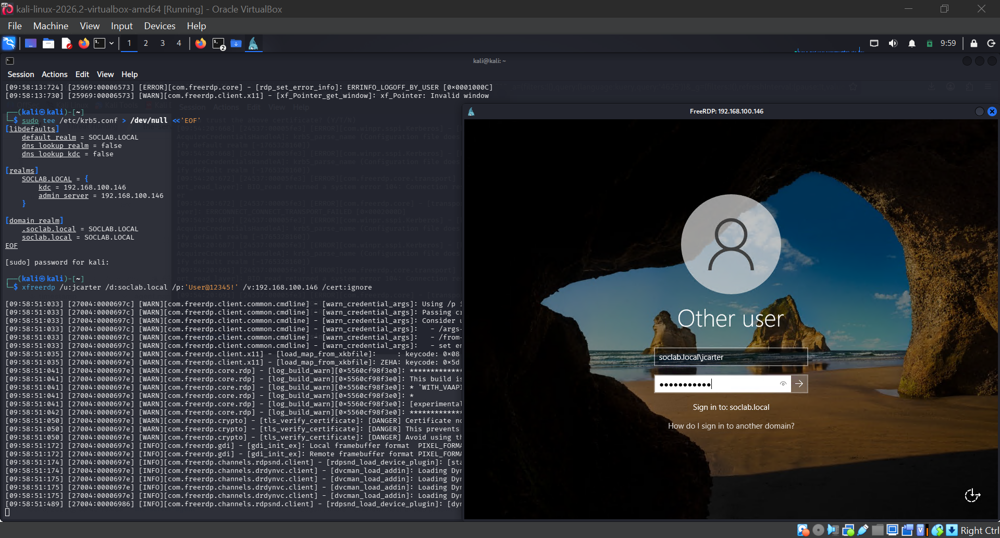

# 🏠 Wazuh Home SOC Lab

A complete, working home Security Operations Center: **Wazuh 4.14.5 SIEM** (Docker, on Kali Linux) monitoring a **Windows Server 2022 domain controller** (`soclab.local`), with four hands-on detection labs — every attack simulated, every event captured, every alert triaged.

Built October 2026 as the SIEM phase of my SOC Analyst journey. This lab is designed to keep growing — new folders land here as new detections, rules, and scenarios are built.

## Architecture

```
┌─────────────────────────┐         1514/tcp (agent events)
│  Kali Linux 2026.2      │         1515/tcp (enrollment)
│  192.168.100.50         │ ◄──────────────────────────┐
│  (attacker box + SIEM)  │                            │
│  ┌───────────────────┐  │                    ┌───────┴──────────────┐
│  │ wazuh.indexer-1   │  │                    │ Windows Server 2022  │
│  │ wazuh.manager-1   │  │                    │ WIN-SOCLAB           │
│  │ wazuh.dashboard-1 │  │                    │ 192.168.100.146      │
└─────────────────────────┘                    │ soclab.local (DC)    │
         ▲                                     │ agent 001: Active ✅  │
         │ https://192.168.100.50              └──────────────────────┘
      Analyst
     (browser)
```

## Lab Index

| # | Folder | What it proves | Key Event IDs |
|---|---|---|---|
| 00 | [Wazuh SIEM — Installation & Configuration](00-Wazuh-SIEM-Installation-and-Configuration/) | A→Z build: Docker → Wazuh stack → agent → Kerberos → static IPs, every command explained | — |
| 01 | [RDP Logon Detection](01-RDP-Logon-Detection-4624-4625/) | Remote logons as a domain user land in the SIEM; reading 4624/4625 like an analyst | 4624, 4625 |
| 02 | [Privilege Escalation Detection](02-Privilege-Escalation-Detection-4728-4729/) | The classic attack pattern: account added to a privileged group, then removed | 4728, 4729 |
| 03 | [Account Lifecycle Auditing](03-Account-Lifecycle-Auditing-4720-to-4740/) | Full account story (create → disable → enable → delete) + a real lockout — and a Kerberos logging blind spot | 4720, 4725, 4722, 4726, 4740, 4767 |
| 04 | [Brute-Force Mini-Incident: Triage](04-Brute-Force-Mini-Incident-Triage/) | Failures → lockout → unlock → success, worked as a SOC triage case with a written verdict | 4625, 4740, 4767, 4624 |

## How to use this repo

1. Start with **00** — it builds the exact environment the labs ran in.
2. Work labs **01 → 04** in order; each assumes the previous one's setup.
3. Every lab README follows the same shape: **Overview → What Is This Lab → Lab Steps (every command explained) → What Wazuh Said → SOC Takeaways**, with screenshots embedded where they were captured.

## 🎁 Bonus Lesson — Tuning: When the SIEM Alarms on Itself

During the static-IP work, the dashboard lit up with PowerShell behavior alerts:



- **92066**: `secedit.exe` launched by PowerShell — level 4
- **92201**: PowerShell wrote a script file under Temp — level 9
- **92031 / 92021**: discovery activity, file deletion — level 3

Expanding the 92066 alert and reading `parentCommandLine` identified the culprit:



```
powershell "$null = secedit /export /cfg $env:temp/secexport.cfg; ...
  Select-String "LSAAnonymousNameLookup" ..."
```

That's **Wazuh's own SCA (compliance) scanner** checking a CIS benchmark setting, running as `NT AUTHORITY\SYSTEM`. The SIEM's scanner tripped the SIEM's detection rule.

**The lesson:** rules detect *behavior*, not *intent*. Severity ≠ certainty — a level 9 can be your own tooling. The fix is never "disable the rule"; it's carving out the known-good pattern (exclude `secexport.cfg` / SYSTEM-parented SCA activity) so a *real* attacker abusing `secedit` still fires. Every SOC keeps a list like this.

## Coming next

- [ ] Sysmon install + `Microsoft-Windows-Sysmon/Operational` channel in `ossec.conf`
- [ ] Custom detection rule: **1102** (audit log cleared)
- [ ] Custom detection rule: louder **4728** for privileged-group additions
- [ ] `wazuh-archives` index for full event retention
- [ ] More attack scenarios (persistence, lateral movement, living-off-the-land)

---

*Part of [SOC-Journey-2026](../README.md) — 90+ lab-generated Windows event IDs, protocol labs, malware triage, and now a live SIEM with real detections.*
